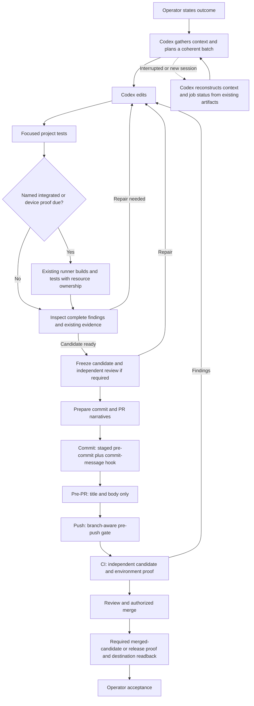
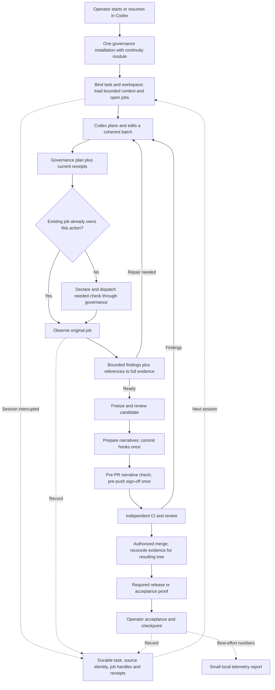
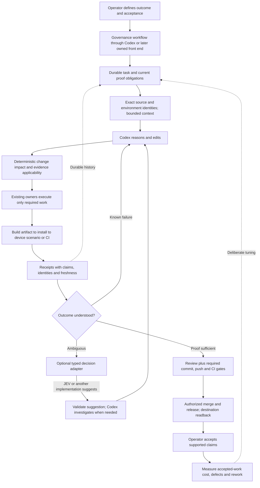

# The development process: now, first release and destination

Accepted direction: 2026-09-19. Codex only for first adoption. Governance owns policy throughout.
“Now” describes governance's intended current workflow, not proof that every adopter follows it.
“First release” is the qualified target; current local code implements only part of it.

## 1. Today: governance with Codex coordination

Governance already has focused selection, execution ownership, telemetry, thin hooks and evidence
rules. The expensive weakness to investigate is coordination: rediscovering instructions, collecting
receipts, interpreting raw logs, waiting, and accidentally requesting the same proof again. Actual
adopter behavior must be measured; this diagram does not assert that all coordination is absent.

Existing policy says: no manual gate immediately before its hook; no broad shipped pre-PR replay;
one expensive build point per coherent batch unless risk requires earlier feedback; reuse only valid
proof; independent CI remains. See [Development Loop](../specs/development-loop.md).

## 2. First qualified release: governance with continuity

The continuity module reduces repeated decisions and reconstruction. It does not replace Codex,
Git hooks, CI, device runners or governance's executor. It does not certify an old result for new
inputs. A prototype's known-job recovery is not yet automatic integration across all hook paths.

The first release qualifies one real local-check workflow. The next slice adds one existing device
runner: build, install and scenario receipts with proper resource ownership. No generic device
scheduler or blanket result cache is required.

## 3. Destination: intent to accepted change with routine coordination in code

The destination is fewer LLM turns spent acting as a scheduler, log relay and memory manager.
Reasoning remains available where it adds value. “Only required work” means governance and project
owners establish applicability; a model never guesses away a gate. External effects retain their
authorization, and release readiness includes actual destination proof.

A later owned CLI/app can start deterministic preparation before an LLM sees the task. The same
internal modules can support that without changing policy ownership. JEV is optional semantic advice.
A shallow repository map and later Mnemos projection earn their place through measured retrieval
benefit; neither is necessary to run this process.

## Where the savings come from

| Cost | First qualified slice | Next measured slice | Longer-term possibility |
| --- | --- | --- | --- |
| Rebuild context | Bounded resume and checkpoints | Tune retrieval on real misses | Optional repository map or Mnemos projection |
| Repeat a running check | Recover and observe existing owner | Link hook and device receipts | Unified proof-progress view |
| Manual check then identical hook | Follow one planned hook path | Diagnose adopter deviations from telemetry | Deterministic next-operation assistance |
| Read huge logs | Structured result and linked detail | Canonical runner-specific parsers | Optional JEV advice on unresolved cases |
| Rebuild/reinstall devices | Measure and preserve job identity | Existing runner validates artifact/install reuse | Owner-controlled end-to-end artifact lineage |
| Broad reruns at every small edit | Coherent batch and focused proof | One expensive checkpoint per measured workflow | Better impact facts where projects can prove them |
| Release bookkeeping | Preserve existing exact receipts | One read-only fact packet | Authorized workflow with live destination readback |

No savings percentage here is measured. [Measurement and qualification](../specs/measurement-and-qualification.md)
contains the low-confidence planning envelope, examples and pilot acceptance criteria.
