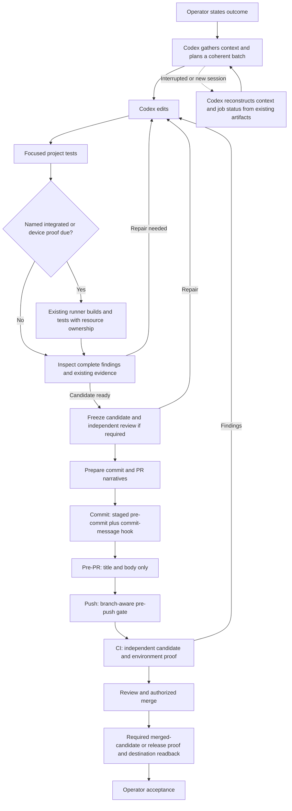
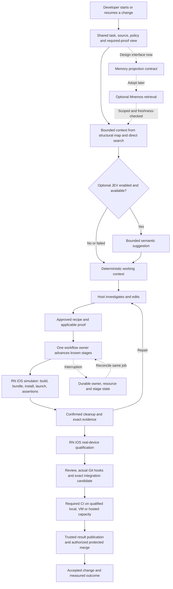

# The development process: now, first release and destination

Updated direction: 2026-09-20. Codex only for first adoption. Governance owns policy throughout.
“Now” describes governance's intended current workflow, not proof that every adopter follows it.
The target is proposed implementation behavior, not a claim that the existing runtime delivers it.

## 1. Today: governance with Codex coordination

Governance already has focused selection, execution ownership, telemetry, thin hooks and evidence
rules. The expensive weakness to investigate is coordination: rediscovering instructions, collecting
receipts, interpreting raw logs, waiting, and accidentally requesting the same proof again. Actual
adopter behavior must be measured; this diagram does not assert that all coordination is absent.

Existing policy says: no manual gate immediately before its hook; no broad shipped pre-PR replay;
one expensive build point per coherent batch unless risk requires earlier feedback; reuse only valid
proof; independent CI remains. See [Development Loop](../specs/development-loop.md).

## 2. Target: shared engine, approved workflow, bounded model advice

The diagram shows platform qualification order; it does not require every bug fix to run both targets.
The project's proof plan determines each task's required lanes. Native iOS and broader platforms
follow the initial RN simulator and RN physical-device qualification. Transport claims are separate.
The [local-CI contract](../../../../docs/specs/engine-local-ci-and-merge-contract.md) defines qualified
execution and merge evidence. Independent CI need not run on GitHub infrastructure; local development
logs alone do not satisfy it. Actual proof planning avoids rerunning already applicable claims.

The worker advances only permitted declared operations. The host receives meaningful change,
completion or intervention; it retains reasoning, edits and acceptance. Existing gates and project
assertions keep their intent until a category-specific change is accepted. JEV and memory are advisory.

## 3. Construction and cutover

Follow the [single transition plan](../../../../docs/exec-plans/active/2026-09-20-unified-development-engine.md):
E0 decisions before dependent work; E1a source seam/preview proof and E1b authorized runner/baseline
assessment; E2 RN simulator; E4 RN physical. E3 implementation follows E1a and compares against its
own retrieval baseline, independently of the RN lane. E5 builds and qualifies selected replacement categories
for the proposed coordinated major cutover. E6 adopts Mnemos later; its interface is designed in E0/E1.

The [migration inventory](../../../../docs/reference/2026-09-20-engine-migration-inventory.md) records
all hook/check/process categories, why they exist and the proposed treatment. The old installed owner
remains intact during construction. No duplicate side-effect execution or permanent compatibility layer.

Savings must be measured in accepted work, native usage coverage, recovery, elapsed time and rework.
See [measurement](../specs/measurement-and-qualification.md); there is no speculative percentage forecast.
