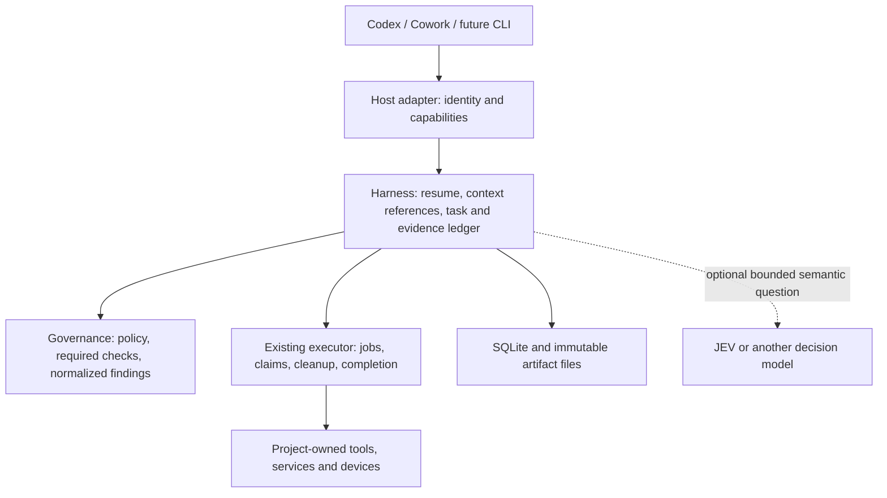

# Greenfield architecture assessment — 19 September 2026

**Recommendation: keep the small runtime, repair its evidence boundaries, and make measurable reduction of repeated work its product goal. Do not expand it into another agent controller.**

The design has a useful foundation. The implementation is an early prototype, not yet a dependable authority or continuity layer. Several passing tests cover the intended local behavior without testing the complete host workflow. Fix those gaps before the planned real-use comparison; otherwise that comparison will measure a broken interface.

This is an assessment and proposal. It changes no implementation or accepted specification.

## Scope and evidence

- Harness source: `c84cb1973351fd7b3d000c027a0e6fa887c3cc00`. Working tree was clean at inspection.
- Governance reference checkout: `96e6a331998d9897ad7490ae055c8ebfdd4451da`. Read its charter, shared test-execution contract, and relevant context/execution/telemetry source. No execution or edits in that repository.
- Reviewed the harness charter, specifications, plans, research, prior review reconciliations, implementation and tests.
- Current verification: **56 tests pass; typecheck passes**, using local Node **24.16.0**. This does not qualify the declared Node 22 minimum, real host integration, device behavior or cross-machine operation.
- Eleven additional bounded probes reproduced the issues described below. Fixtures and outputs stayed inside this repository, under `.harness/architecture-review-2026-09-19/`. See probe results (original checkout reference: `../../.harness/architecture-review-2026-09-19/probe-results.json`) and probe script (original checkout reference: `../../.harness/architecture-review-2026-09-19/probe.mjs`). These local files are ignored; they are not a published test suite.
- External research uses primary documentation retrieved on 19 September 2026. Publication dates are stated where available. Living documentation establishes documented behavior on the research date, not verified behavior in the installed applications.
- The historical telemetry figures below are claims in the existing baseline report. This review did not reconstruct those datasets or validate live release endpoints.

## 1. What has been built

The runtime has four useful domain objects: Task, Action, Artifact and Evidence. Tasks preserve revisions and can fork. Actions have durable status changes with revision checks. SQLite lives under the Git common directory, so linked worktrees on one machine can share records. Source retrieval supports Git subjects, and a CLI records check output and execution duration.

There is also a generated instruction block, task/session activity tracking, advisory file-overlap reporting, JSON export and a small provider-free implementation. There is no JEV integration in the delivered source.

Important distinctions:

| Area | Current reality |
| --- | --- |
| Durable records | Implemented locally; action transitions overwrite their previous status rather than retaining a full transition history |
| Context continuity | Task notes and retrieval primitives exist; a compact, useful resume packet and complete artifact-read workflow do not |
| Governance integration | Required by the design; no public governance adapter is present in the delivered source |
| Execution | A synchronous subprocess runner, not integration with governance's existing supervised batch owner |
| Worktrees | Shared database and parent-task pointer; no merge/rebase reconciliation protocol |
| Host support | Instruction-file generation; no demonstrated Codex/Cowork capability qualification |
| Token accounting | Nullable fields exist; execution records contain no host token usage, and totals turn unknown into zero |
| Savings | No controlled end-to-end comparison yet |

Keep SQLite, native TypeScript, the small JSON interface, the separation of verification from acceptance, and the requirement that the core works without a model. Keep governance as the policy/check owner and the host as the editor.

The rule that everything must be one of four objects should remain a simplification aid. It must not prevent adding supporting identities, relationships or an append-only transition table when correctness requires them.

## 2. The product goal needs a clearer connection to cost

“Continuity” is a mechanism. The product outcome is **less repeated work per accepted task, without more mistakes or operator intervention**. Keep reliability as a requirement, but do not let it replace the original efficiency goal.

The existing [baseline](../research/pass-a-baseline.md) reports repeated subjects in 71% and 54% of non-commit-message observations, and 4h27m of test execution in an approximately 34-hour SDK sample. It explicitly says token consumption and resume fidelity were not measured. These numbers identify places to investigate; they do not establish avoidable waste or token savings.

There is also a denominator problem to resolve: the report lists 495 governance runs, then 624 non-commit-message “runs.” Those may be distinct event/run counting units, but the report needs to explain that and retain the aggregation query before the percentage is decision-grade.

A ten-minute test can consume almost no agent tokens if it runs independently and returns once. Conversely, ten seconds of repeated planning and log narration can be token-expensive. Measure test compute, waiting overhead and model usage separately.

Prioritize these candidate savings:

1. Resume with a short, current account of intent, decisions, evidence and next work.
2. Submit known mechanical workflows once; receive one useful result.
3. Return bounded failure details and direct receipt access, avoiding full-log rereads.
4. Reuse existing execution identities and in-flight jobs where the existing owner permits it.
5. Collect release facts from existing project tools, with provenance and timestamps.
6. Use a small decision model only where semantic judgment remains expensive after those changes.

## 3. Defects to repair before a pilot

The following are implementation findings, distinct from the larger design recommendations.

### P1 — Retrieved content is not reliably bound or delivered

In [retrieval.ts](../../src/ops/retrieval.ts), `resolveSubject` computes a tree digest, but `readAtSubject` later reads the current index or original symbolic ref. If the index or branch moves between those calls, the artifact gets the old identity and new bytes. The probe demonstrated this with two staged versions. A worktree request also reads the index, not the working file.

In [cli.ts](../../src/cli.ts), `context get` returns source path, size and subject only. It returns neither the retrieved content, an immutable materialized path, nor an artifact ID with a dedicated read command. The whole-store export is not a useful substitute. The agent is charged retrieval budget but cannot consume the source through the advertised workflow.

Other gaps in this path:

- Missing mandatory files are reported as unavailable but do not block. Mandatory paths absent from the requested list are not added.
- Scope checks apply to explicitly requested paths, not automatically selected changed paths.
- Clean-checkout fallback passes absolute scope directories to a Git file reader; it does not discover a useful starting context.
- Equal file contents in one subject collapse to one artifact with the first path. The probe retrieved `a.txt` and `b.txt`, but received two `a.txt` locators.
- Budget accounting uses best-effort evidence, permits a new ceiling per request, and is not an atomic reservation across concurrent readers. It is not a hard task budget.

**Change:** read immutable Git object IDs; handle live worktree files explicitly; separate content blobs from source locators; authorize every resolved path; return bounded content or immutable readable artifacts. Treat the byte ceiling as a retrieval guard, not measured tokens. Provide deliberate expansion rather than an irreversible lifetime reading limit that eventually prevents a long task from continuing.

### P1 — Declared authority exceeds actual enforcement

[authority.ts](../../src/ops/authority.ts) treats `check` as non-mutating, but [execution.ts](../../src/ops/execution.ts) can execute arbitrary commands. Checking the working directory does not constrain a subprocess's filesystem or network effects. Tests themselves can update snapshots, generate files or use external services.

The action does not durably bind command, argument array, executable identity, environment or input manifest before execution. `--subject` is accepted as an arbitrary label. A successful exit therefore cannot establish that the named source was tested.

Task version is checked during authorization, but not again at dispatch. A probe authorized an action, cancelled the task, then successfully ran a command that wrote a fixture file. The revision counter also does not enforce legal lifecycle transitions: the store permits status changes based on revision alone.

Task provenance is asserted by the caller. The same CLI can add an “operator” constraint, revoke a constraint, and mark a task accepted. It has no independent actor or authorization evidence. A prose regex is not an implementation of arbitrary operator prohibitions.

**Change:** state honestly that the host authorizes and enforces effects. Bind each declared command to a typed execution request and upstream job/receipt. Recheck task/policy applicability immediately before dispatch. Enforce legal transitions. Distinguish host-reported intent from independently verified authorization. Add only narrowly structured constraints the runtime can actually enforce.

This does not call for another permissions system. It calls for a smaller claim and an integration with the owner already responsible for execution.

### P1 — Recovery cannot distinguish interrupted work from active work

[recoverAll](../../src/ops/actions.ts) scans every prepared/in-progress action in the shared database. There is no executor identity, liveness check or ownership generation. The probe showed recovery changing another live action to `outcome-unknown`. The original worker can then lose its completion transition even though its process continued.

The CLI inspector treats output-file existence as completion. A pre-existing file cannot prove that this action produced it. Missing output does not prove that no other effect occurred. Recorded recovery text also suggests rerunning a command to compare receipts, which cannot establish what the previous attempt did.

**Change:** reference the supervised execution owner's job identity and immutable result. Recover only after establishing ownership loss or an explicit owner handoff. Check a receipt bound to this invocation, not file existence. Preserve uncertainty and never turn recovery into automatic replay.

### P1 — Shell and evidence outcomes can mislead consumers

A check that exits 7 returns JSON with `ok: false` but the harness process exits 0. This can turn a failed check into a successful shell pipeline or hook unless every caller knows to parse JSON.

Receipts truncate output at 64,000 characters without storing the full log elsewhere. They lack a structured execution envelope and use joined arguments in their identity. Non-timeout spawn errors and signal termination become “refuted” rather than an unestablished test claim.

**Change:** define stable command exit semantics; retain complete logs as files; store a structured receipt with argv, cwd, input identity, executor result and failure category. A runner failure must not masquerade as a tested assertion.

### P2 — Concurrency warnings are incomplete and sometimes wrong

[treeDigest](../../src/ops/concurrency.ts) hashes HEAD and porcelain status, not dirty contents. Two edits to an already-modified file can produce the same digest. This was reproduced. The warning also claims “you did not cause it,” although it cannot determine which actor edited a file.

[sessionId](../../src/store/location.ts) falls back to the CLI process ID. Every invocation becomes a different session. A single caller's successive commands showed up as several other active sessions in the probe. The generated adapter does not establish a persistent `HARNESS_SESSION`.

Exploration is not immune to concurrency: a reader can observe inconsistent source while another agent writes. Producing a specification can itself involve file writes. Silencing every warning for `explore` hides these distinctions.

**Change:** use stable host session identity, separate read dependencies from planned write ownership, and detect relevant content drift. If identity or observation is unavailable, say coverage is unknown. Do not infer another actor from a change. Reserve blocking behavior for operations the harness can actually mediate.

### P2 — Usage data cannot support the proposed evaluation yet

[usageTotals](../../src/store/store.ts) converts missing tokens and cost to zero. The probe confirmed it. Delivered source only records execution duration, not native host usage. Current `task show` also returns all actions and evidence, so its token footprint grows with the task.

**Change:** preserve nulls; report coverage and observation source. Capture native host usage where supported. Add cached-input, uncached-input, output and any separately reported reasoning usage without double counting. Treat source bytes and tool calls as proxies, not token measurements. Make resume output bounded and incremental.

### P2 — Documentation and rollout claims need reconciliation

The progress log says 38 tests; current source has 56. Several specs say no implementation. Plans still call files the store. The usage guide locates the database in `.harness`, while Git repositories use the common Git directory. The core says the harness never writes the worktree, but `init` edits instruction files; make installation an explicit separate operation if retaining it.

The release survey labels eight listed judgment rows as seven and infers operational availability from installed clients. “18 of 25 fields off the operator's hands” is a hypothesis, not a verified saving. A dependency does not establish credentials, query semantics, health evidence or successful retrieval.

**Change:** publish one compact implementation-status table with tested capability and proof limits. Archive or label superseded design material so a new session does not rebuild context from contradictory documents.

## 4. Greenfield shape I would choose

Keep a portable library behind a versioned JSON command interface. Add optional thin host adapters. No daemon, distributed database or general workflow engine is needed for the first pilot.

The harness's unique responsibility is answering: **What are we doing, what changed, what can we rely on, and what remains?**

Prefer a few operations at natural task boundaries:

- **Start/resume:** bind the host session, resolve the intended task, inspect current workspace identity, and return a short brief plus changes since the last acknowledged checkpoint.
- **Context:** serve selected evidence or source ranges with exact identities. Native host reads can remain available where recorded provenance is sufficient; do not force every exploratory read through a wrapper by default.
- **Run/status/result:** submit a typed request to the existing owner, persist its job ID, then consume its durable result. Bundle predictable steps without asking the LLM to narrate each one.
- **Checkpoint/handoff:** record changed understanding and references once per coherent batch. Let code collect mechanical facts; the host contributes reasoning and unresolved questions.
- **Reconcile:** compare the task's previously applicable evidence with the current merged/rebased source and policy.

These are illustrative operations, not a proposed immediate CLI expansion. First prove one vertical path: start → obtain usable context → existing execution owner → compact result → resume in a fresh session.

Do not automatically select any open task because it happens to share a worktree. Prefer an explicit session/task binding; when ambiguous, return candidates. Likewise, continuing the same objective in a new worktree can be a new attempt on the same task. A genuinely independent objective should fork a child task. Conversation branching alone does not decide that semantic distinction.

## 5. Worktrees, shared workspaces and history

**A Git merge combines source. It does not merge task truth or make old test evidence valid for the result.**

The shared common-directory database is a good local default. It solves discovery across linked worktrees. It does not travel with a push, connect independent clones, or identify a workspace after a folder move. Keep local storage location separate from stable identity.

Supporting records should distinguish:

| Identity | Why it matters |
| --- | --- |
| Repository ID | One logical project across explicitly linked clones; do not infer solely from a remote URL |
| Workspace ID | A checkout instance with a current path and host; paths are locators, not permanent identity |
| Task and task revision | The objective and exact authorized constraints |
| Session/attempt ID | Which host execution continued the task, with parent attempt where applicable |
| Source snapshot | Commit, tree, index and relevant dirty/untracked content, clearly distinguished |
| Action/job/receipt ID | Which executor ran what, with policy, toolchain and environment applicability |

### Carry knowledge by reference, with conditions

Forks should reference the exact parent revision and checkpoint. Current `parentTask` does not record the parent revision. Copying plain-text ruled-out conclusions loses the conditions under which they were true; copying only selected items also discards useful handoff knowledge.

Record a finding's supporting evidence and applicability. “This approach failed with dependency X at version Y” may be reusable. “This approach never works” is usually too broad. Operator constraints persist until explicitly revised; observed facts remain facts about their original subject; hypotheses remain hypotheses.

Use append-only transition/reconciliation records for important changes. Current-state tables can remain efficient projections. This needs no event broker or general event-sourcing framework.

### Reconcile a merge explicitly

1. Record the source tasks/attempts, their exact input snapshots and the resulting merge commit/tree.
2. Preserve all original receipts unchanged. Their historical claims remain true or false about the original inputs.
3. Classify relevance to the new target as applicable, stale, conflicting or unknown. Equality of code alone does not prove environment-dependent evidence reusable.
4. Ask governance which proof the combined change requires. A green feature branch does not automatically certify the merge result.
5. Surface conflicting constraints or decisions for the appropriate owner. Never resolve authority by latest timestamp or model confidence.
6. Write a short integration checkpoint: what landed, what did not, surviving decisions, unresolved conflicts and new proof.

Example: task A validates an API change in worktree A. Task B changes its caller in worktree B. Both checks pass separately. After merging, retain both receipts as history, but require the combined contract check for the resulting tree. Do not copy either task's accepted status onto the merged task.

Rebase and cherry-pick follow the same rule. Record their old/new identities; patch similarity can suggest a relationship, but does not establish test validity. Deleted worktrees should not destroy task history. Needed evidence must not depend on an ephemeral worktree path or eventually garbage-collected Git object alone.

### Shared-workspace protections should be proportional

| Scenario | Minimum useful behavior |
| --- | --- |
| Two readers | Allow; pin important reads or report live-source drift |
| Reader and writer | Warn when the reader's dependencies changed; refresh the affected conclusion |
| Two writers on disjoint files | Allow cooperative path ownership; still serialize shared Git-index/commit operations |
| Two writers on overlapping files | Require coordination or suggest separate worktrees before the write |
| Two worktrees using one simulator, port or deployment target | Use the existing machine/resource owner; worktrees do not isolate these |
| Uninstrumented editor or host | Report partial coverage; do not promise overwrite prevention |

Advisory path intentions are useful even without enforcing every host edit. Strict exclusion is only credible where all relevant writers participate or the environment isolates them. Avoid building a second lock manager for resources governance or project tools already own.

### Cross-machine history: define portability now, defer synchronization

Keep SQLite local. Do not Git-merge database files or run one database on a network share. Add a versioned export/import bundle only when another clone needs continuity: stable IDs, hashes, provenance, selected events and required artifacts. Import idempotently; preserve conflicts; imported authorizations do not grant authority to the receiving host.

Current export has no import protocol or transaction covering its multi-table read. A useful portable checkpoint needs a coherent database snapshot. Export only selected shareable records; source and log content can include private data. Define retention and artifact pinning around active tasks and accepted evidence before pruning.

## 6. Research implications as of September 2026

These are documented practices and design lessons, not a claim that one universal harness architecture has won.

**Persistent progress and acceptance evidence are established practices.** Anthropic's November 2025 work describes incremental sessions, progress artifacts and explicit feature verification. It supports the continuity goal, but does not establish that a separate runtime improves every workflow. [Effective harnesses for long-running agents](https://www.anthropic.com/engineering/effective-harnesses-for-long-running-agents).

**Harness complexity must be re-earned as models improve.** Anthropic's March 2026 account describes removing components and evaluating their contribution individually. Apply that discipline here: compare each addition against an existing host plus governance, and retire controls that no longer pay. [Harness design for long-running application development](https://www.anthropic.com/engineering/harness-design-long-running-apps).

**The initial integration need not rely only on an LLM remembering instructions.** Current official OpenAI documentation describes lifecycle hooks for session start, compaction and tool events. Hooks can supply a short resume packet or capture mechanical events without asking the model to manage those steps. They have trust/configuration and failure semantics, and actual Desktop support must be qualified. [Codex hooks](https://learn.chatgpt.com/docs/hooks).

**A future custom UI need not recreate the agent loop.** Codex App Server documents a reusable integration surface, including `thread/tokenUsage/updated`. That is a possible later front door and accounting source; it does not prove this existing Desktop session exposes those events to an external adapter. [Codex App Server](https://learn.chatgpt.com/docs/app-server).

**Claude Code and Cowork require separate capability checks.** Claude Code documents lifecycle hooks, stable session inputs and fork/resume handling. Cowork documents folder instructions and plugins; that does not establish identical local command, hook, filesystem or token-reporting contracts. Test a tiny end-to-end adapter per actual host version before calling it supported. [Claude Code hooks](https://code.claude.com/docs/en/hooks), [Cowork guide](https://support.claude.com/en/articles/13345190-get-started-with-claude-cowork).

**Parallel agents have a cost and an ownership problem.** Anthropic explicitly warns that agent teams use more tokens and same-file edits can overwrite each other. Codex worktrees provide separate checkouts. Neither fact makes parallelism a default cost optimization, nor isolates machine-global resources. [Claude Code teams](https://code.claude.com/docs/en/agent-teams), [Codex worktrees](https://learn.chatgpt.com/docs/environments/git-worktrees).

**Separate conversation state from shared knowledge.** LangGraph distinguishes thread checkpoints from cross-thread stores. Borrow that distinction: session recovery, shared project decisions and portable evidence are different lifetimes. Adopting LangGraph itself would duplicate host-owned orchestration here, so there is no current reason to add the dependency. [LangGraph persistence](https://docs.langchain.com/oss/python/langgraph/persistence).

### JEV's role

JEV is a learned model, not deterministic automation. It may make a bounded semantic judgment cheaper than a frontier LLM. Code should continue to own exact comparisons, arithmetic, permissions, state transitions and gates.

TypeSafe's `jev-1.13` limitations page, reviewed by the vendor on 17 September 2026, identifies numeric/date weaknesses, sensitivity to irrelevant context and adversarial content, and structural inconsistencies between question forms. Its confidence documentation describes a distribution-derived statistic, not a blanket probability that taking an action is safe. [JEV limitations](https://docs.typesafe.ai/model-jaggedness/jev-1.13), [Confidence](https://docs.typesafe.ai/confidence).

Choose one bounded comparison: normalize known runner failures deterministically, then ask JEV to classify the remaining short failure snippets into a fixed diagnostic set including “unknown.” Compare against deterministic matching and the existing host. Begin in shadow mode; downstream authority stays unchanged. Count extraction, provider calls, fallback, resumed host context and rework. Shadow mode establishes quality/cost estimates, not realized savings if the full host path still runs.

| Integration choice | Assessment |
| --- | --- |
| Replace deterministic governance with JEV | Reject: probabilistic answers cannot own exact policy or evidence identity |
| Add JEV before every action | Reject: increases calls and bookkeeping without measured benefit |
| Optional typed adapter for one semantic bottleneck | Preferred experiment after the provider-free path works |
| No JEV | Valid outcome if deterministic automation and host improvements remove the cost |

There is no measured target-workload calibration or savings result in this reviewed implementation. Do not adopt a model because a confidence field exists.

## 7. Recommended next sequence

1. **Repair the prototype contract.** Usable immutable retrieval, truthful outcomes, current authorization at dispatch, and recovery ownership. Reconcile docs with source.
2. **Integrate one real path.** One host, one adopter, existing governance executor. Persist stable session/attempt identity and deliver a compact resume packet. Keep the ordinary host fallback.
3. **Prove the scenario matrix.** Fresh-session resume; user correction; same-workspace readers/writers; worktree fork; merge/rebase; executor crash; duplicate request; late completion; deleted worktree. Use deterministic fixtures before scarce device proof.
4. **Measure a small matched pilot.** Compare host + governance against host + governance + harness on representative bug fixes, resumed investigations, long checks and release preparation. Hold model settings and acceptance criteria steady; control for warm caches and task familiarity. A small pilot is directional evidence, not a universal percentage.
5. **Add one optional decision experiment only if the pilot identifies a semantic cost.** Separately evaluate whether it improves accepted work.

For the pilot, record accepted tasks, later defects, rework, operator interventions, time to resume, time to first actionable failure, total elapsed time, test compute, model turns, native token categories, measurement coverage and harness overhead. Include all child-agent/provider work. Where a host exposes no token totals, report that gap; do not label byte counts or execution time “token savings.”

Require a correct fresh-session continuation and no unreported evidence mismatch before interpreting efficiency. Then compare total cost per accepted task. Pause or remove features that add ceremony without improving that outcome.

The immediate next build should prove **one trustworthy resume-and-execute loop**. Broad model routing, automatic release execution, cross-machine synchronization, a custom desktop app and a new general orchestration engine can wait.

## 8. Deferred substrate candidate: Mnemos

**Operator direction, 19 September 2026:** keep Mnemos on the architectural roadmap, but do not introduce it now. SQLite remains the implementation and comparison baseline. This note creates no integration workstream or dependency.

Quick orientation covered Mnemos's canonical developer guide (original checkout reference: `/Users/stacy/ASENSEI/asensei-mnemos/docs/developer/index.md`), Chapters 1–2, and relevant retrieval, planning, graph, mobility and storage references at checkout `b17561127829f6a7421dbdeb9555bd6436aa01f9`. The old `docs/developer-guide.md` is a compatibility map. This was documentation review, not source/runtime or published-package qualification.

### Where it could fit

Mnemos is a governed continuity substrate, so its potential value extends beyond replacing a database:

| Harness need | Potential Mnemos contribution |
| --- | --- |
| Short, attributable resume context | Bounded evidence retrieval and context assembly, including omissions and degradation |
| Decisions and dependencies across tasks | Reviewed relationships, graph inspection, lineage and supersession |
| Persistent planning understanding | Constraints, options, rationale, checkpoints, outcomes and explicit lifecycle history |
| Moving selected knowledge between hosts | Scoped portable categories, replay handling and owner-specific merge semantics |

These are candidate mappings, not claims that Mnemos already implements development-task or Git reconciliation. Harness retains repository/workspace identity, task meaning and Git applicability rules. Governance retains policy and acceptance requirements. The execution owner retains processes, resource claims and recovery. Mnemos would supply continuity under those owners, not replace them.

### Keep the option open cheaply

- Keep SQL and storage details inside the existing store module; expose operations in terms of task revisions, evidence identities and explicit outcomes.
- Preserve stable IDs, provenance, lineage and versioned portable records independently of database row layout.
- Separate execution-critical state from context/knowledge projections. A future retrieval failure must not change action authority or erase an execution receipt.
- Do not add a generic provider framework or shape today's domain objects around Mnemos APIs. Extract the smallest adapter only when a real experiment needs it.

### Place in the roadmap

After the repaired SQLite path and matched real-use pilot establish correctness, continuity and cost, revisit Mnemos **when a measured need for richer lineage, cross-task retrieval or portable continuity appears**. This evaluation is independent of JEV; either could be useful without the other.

The first experiment should replay a bounded, versioned export into a disposable Mnemos projection and compare resume quality, retrieval omissions, correction propagation, latency and operating cost. SQLite remains authoritative during that experiment. Promote one continuity capability only if it earns its cost. Any later replacement of execution-critical persistence needs a separate durability/concurrency/recovery assessment, migration verification and rollback path.

### Specific questions to revisit then

The Planning reference (original checkout reference: `/Users/stacy/ASENSEI/asensei-mnemos/docs/developer/reference/capabilities/planning-continuity.md`) describes an active subject-level planning thread, not arbitrary caller-defined concurrent planning threads. The harness must establish a sound mapping for multiple tasks and worktrees rather than assuming it.

The State Mobility reference (original checkout reference: `/Users/stacy/ASENSEI/asensei-mnemos/docs/developer/reference/capabilities/state-mobility.md`) excludes plans, goals and arbitrary graph objects from built-in portable categories. It also documents a delta-export gap and aggregate rather than per-item merge outcomes. It therefore does not already solve portable harness history or Git-merge reconciliation.

Finally, storage readiness and durability (original checkout reference: `/Users/stacy/ASENSEI/asensei-mnemos/docs/developer/reference/capabilities/storage-protection-and-recovery.md`) are target-specific. TypeScript API availability alone does not establish the Node-hosted, multi-process durability needed here. Verify the exact package and runtime when the experiment is justified; keep this uncertainty out of the current delivery path.
