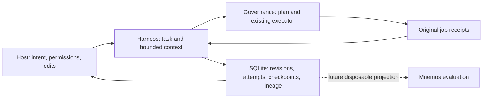

# Architecture reset: implementation and review reconciliation

Status: complete. Implementation validated; Opus review and focused rechecks reconciled. 19 September 2026.

The current contracts are [the specification index](../specs/README.md). This reset implements the
provider-free continuity path from the [greenfield assessment](2026-09-19-greenfield-assessment.md).
It does not claim measured token savings or completed host adoption.

## Ownership

## Implemented and demonstrated

| Area | Implementation | Current proof |
| --- | --- | --- |
| Retrieval | Pinned Git trees, live bytes, mandatory context, artifact paging, shared budgets | Regression and fresh-process CLI tests; two concurrent budget writers |
| Governance integration | Public plan/batch/result/status/wait/cancel CLI; no local runner | Real source CLI pass/failure, crash and cleanup fixtures |
| Continuity | Stable attempts, bounded resume, checkpoints, pinned fork origins | Tests for fork ancestry, fresh process, scope warning and bounded envelopes |
| Workspaces | Git common-dir store, distinct workspace IDs, advisory read/write intentions | Linked worktree and symlink alias fixtures; no universal filesystem exclusion |
| Merge/rebase | Exact target commit/tree; manifest/tree comparison, immutable old receipts | Declared-input match and stale-source tests; no gate reuse or automatic acceptance |
| Portability | Selected bundle export and inert import | Integrity, idempotence, numeric-key round trip; no distributed synchronization |
| Measurement | Null unknowns, native sample identity, cached/reasoning subsets | Unit/CLI tests; no actual savings measurement yet |
| Store | SQLite schema 6, v4/v5 migration path, durable records and file blobs | v4 migration, unknown-version refusal, nested rollback and concurrent process tests |

Validation: 71 tests pass, typecheck passes, `git diff --check` passes on Node 24.16.0. The declared
minimum Node 22.18 has not been separately qualified in this run. Exact receipts and review audit
are in [validation.json](2026-09-19-validation.json).

## Claude Opus 5 review

Requested model `claude-opus-5`, effort `xhigh`, fallback `none`, write mode `none`. First run
completed successfully without repository changes. [Full review](2026-09-19-opus5-implementation-review.md).

Process exception: Claude wrote the review to its own local plan file despite the read-only
instruction. The review was copied verbatim here. The wrapper audit covers repository changes,
not arbitrary outside files. The recheck explicitly prohibits plan-file writes as well.

| Finding | Reconciliation |
| --- | --- |
| F1 completion wait | Fixed: owner `--until-terminal`, bounded observer timeout. Real `check run --wait 5` returns 0/1 directly. Timeout kills only the observer, never the job. |
| F2 unconfirmed vs failed | Fixed: persist/return established separately. CLI assertions: pass 0, refuted 1, unconfirmed 2, pending 3. Real killed-worker recovery returns 2. |
| F3 lost local job link | Fixed: raw acknowledged response is durably recorded before linking; recovery can reconstruct the link from it. If storage fails completely, error output retains the action/known response. Lost external response still requires investigation; no replay. |
| F4 unknown drift | Fixed: unknown is explicit, including missing/oversized observations. |
| F5 dead concurrency API | Removed old methods/table and replaced their tests with the production read/write-intent path, including explore-mode writes. |
| F6 cancellation/orphans | Added safe CLI cancellation and visibility for authorized records with an execution binding. Pre-dispatch cancellation is local; dispatched cancellation goes through the owner. Deliberately reject locally cancelling an unlinked uncertain job: it would invent proof that effects stopped. Missing owner state remains actionable, never silently hidden. |
| F7 wrong workspace | Resume returns current attempt and workspace-scope status plus the explicit revision hint. Binding itself never broadens scope. |
| F8 result protocol | Supported submission versions 1/2 recorded in response; cleaned terminal version 1 required. Unknown versions fail closed. |
| F9 budget readback | Fixed: return atomic reservation totals, with an intervening-reader regression. |
| F10 repeated hashing | Removed source hashing from metadata activity updates. Status/path reports hash once, bounded to 2000 paths and 8 MiB. |
| F11 inherited findings | Per-item origin task/revision is preserved through later forks. |
| F12 merge applicability | Compare each declared manifest file with the target tree. Report declared-inputs-match/stale/unknown; completeness and environment remain separate. Root-only checks and live snapshots remain unknown. |
| F13 numeric JSON keys | Reproduced the proposed scenario; normal JSON stringify/parse already preserves the serialized JavaScript key order, including numeric keys. Added regression; no new serializer. Reordering bundle keys externally can invalidate its digest, as documented by structural bundle identity. |
| F14 nested transaction | Task version writes now use the shared savepoint-aware transaction helper; outer rollback regression passes. |
| F15 stuck cleanup | Pending results include owner stage/elapsed time. Real missing acknowledgment stays pending with a cleanup hint, then completes after this resource-free fixture truthfully acknowledges cleanup. |
| F16 unbounded event details | Reconciliation details are a linked receipt artifact. CLI event pages cap details and total output; resume uses summaries. |

Additional self-review fixes: `deny:read`/`deny:record` now cover retrieval/checkpoint CLI boundaries;
optional native usage action ID normalizes to null; governance `timed_out` is unconfirmed terminal;
symlink aliases share intentions; merge target commit is pinned before resolving its tree; Git text
retrieval rejects directories/binary blobs; resume exposes its attempt ID. No-action evidence gets
a revision in its ledger record; legacy unversioned evidence remains unknown.

Removed unused target-routing/changed-path/completion helpers. Kept coherent `exportJson` as a
small diagnostic API and retained reserved domain enums/columns for schema compatibility; these
are explicitly not additional implemented capabilities.

## Remaining qualification

The real executor fixture runs governance's public source entry from a repository-contained Python
runtime. It is not certification of a published immutable governance artifact. The source checkout had
untracked research documents; protocol source hashes and its Git status are recorded in the receipt. No other project
was edited or installed into. Test jobs and temporary state stayed inside this repository.

Real Codex Desktop, Claude Code and Cowork lifecycle behavior still needs a small adopter pilot.
The pilot must rederive the historical baseline denominator, count overhead/retries/rework and
compare accepted outcomes. JEV, Mnemos and release automation stay at their documented future gates.

## Focused recheck reconciliation

[Opus recheck](2026-09-19-opus5-recheck.md) closed F1/F2 and the other main fixes, judged the
architecture ready for a controlled provider-free pilot, and returned seven smaller findings.

1. Cancellation now repairs an acknowledged local job link before routing to the owner.
2. Added dispatched/pending cancellation, CLI cancellation and authorized-orphan regression tests.
3. A shared check observer preserves action/job identity and waitError even if waiting fails; it
   still consumes the result when available. Cached final receipts do not require a live owner.
4. Failed progress lookup leaves pending intact with statusError and unknown stage.
5. Documented cancellation's status-oriented exit semantics separately from assertion verdicts.
6. Aligned the remaining unconfirmed exit-code wording.
7. Memoized and capped manifest comparisons by unique paths, bytes and a shared Git-inspection
   deadline. Recorded the clean/smudge, EOL and LFS representation limit in the receipt and guide.

Also tightened the legacy-evidence guard: a ledger entry without a numeric task revision remains
unknown, even when its tree bytes match. Added schema-5-to-6 and legacy-evidence regressions.

The [final narrow Opus recheck](2026-09-19-opus5-final-recheck.md) closed all four targeted
cancellation/observer findings and reported no review blockers. Both rechecks wrote no files and
changed no repository content. The last low-priority nit was resolved with an explicit guard against
locally cancelling inconsistent pre-dispatch state that already names an owner job.

Final source CLI evidence also covers manifest mutation (exit 2, unconfirmed) and owner cancellation
(pending until cleanup, then cancelled without assertion evidence). All 71 regression tests,
typecheck and whitespace checks pass on the final source. No token-savings percentage is claimed.
