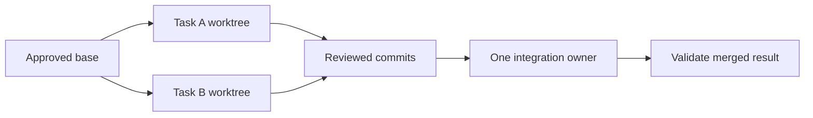

# Work safely across Git worktrees and Codex chats

Use one active writing owner per worktree. Give independent implementation tasks separate worktrees,
and bring reviewed changes into one project-designated integration branch. Reuse an existing task's
worktree when continuing it; a new prompt, review or governance upgrade does not need another checkout.

These are operating practices, not a new locking service. Governance's recorded intentions help
detect overlap; they do not stop an unrelated process from editing files. The
[RC6 contract](../../specs/engine-rc6-linked-retrieval.md#multiple-worktrees-and-coordinated-upgrades)
owns runtime/index behavior. Its expanded index and cross-version qualification remain planned
until the implementation plan records proof.

## Choose where the work belongs

| Work | Recommended place |
| --- | --- |
| Continue an existing feature or fix | Its current chat and worktree, after checking identity and state |
| Start independent implementation while another writer is active | A separate worktree with an explicit base commit and scope |
| Review changes without editing | A frozen commit or captured diff; another writer must not silently change the reviewed input |
| Integrate completed work or approve a governance pin | The designated integration worktree, with one integration owner |
| Run a device, simulator or local CI lane | The owning task's checkout, with explicit ownership of shared machine resources |

The integration branch may be `main`, `develop`, a release branch or another project choice. Name it
in the project instructions; do not infer it from a folder name. This role does not require a new
worktree if a suitable existing checkout is available.

## Start or resume a Codex task

1. Select the intended project and location. For parallel implementation, choose **Worktree** and
   verify its starting branch. Codex can start with detached HEAD; create a named branch when retaining
   or sharing that work. For an existing task, confirm its actual checkout instead of creating another.
   These controls are described in [OpenAI's worktree guide](https://learn.chatgpt.com/docs/environments/git-worktrees).
2. Verify the directory, branch/commit, dirty files and other linked checkouts. Inspection commands:

   ```sh
   git rev-parse --show-toplevel
   git rev-parse --git-common-dir
   git rev-parse HEAD
   git branch --show-current
   git status --short
   git worktree list --porcelain
   ```

   An empty branch name means detached HEAD. A brand-new repository may have no HEAD yet. Neither
   case is permission to guess a branch, discard files or borrow another checkout's runtime.
3. Read the applicable `AGENTS.md`, scoped guidance and any local overrides. Check for conflicting
   old commands, hard-coded sibling paths, automatic delegation or stale release instructions. Keep
   the root instructions short and link this guide; do not copy it into every agent file.
4. State the goal, owned paths, base/integration target and validation boundary in the existing task
   brief. Use one fixed coding model by default. Extra reviewers or delegated implementation need a
   clear assignment; they do not inherit permission to edit the parent's checkout.
5. Use the project's normal pinned runtime and task/context entry. Inspect readiness through the
   local launcher, for example `.governance/runtime/bin/project-governance doctor`. If it is absent,
   use that project's documented exact-version bootstrap. Do not copy a sibling's `.governance`
   directory or invent new installation commands.

Codex chats and filesystem isolation are different things. Several Local chats can point at the same
checkout; a conversation fork alone is not proof of a separate worktree. Read back the path before
writing. Pinning or naming a chat does not reserve files, a branch, a port or a simulator.

Use project-owned [local environment setup](https://learn.chatgpt.com/docs/environments/local-environment)
for repeatable worktree preparation. Our recommended setup installs declared dependencies and the
already approved governance pin; it does not discover a newer release, merge branches, run full CI
or launch devices on every new chat. Keep credentials in the approved local environment, not Git.

## Keep parallel work from colliding

Separate worktrees protect source edits, not every resource on the computer. Assign a distinct port,
output directory and test identity where supported. For shared Metro processes, build daemons,
simulators, physical devices or databases, use the project's governed workflow and ownership records.
Two tasks cannot independently reset the same resource safely.

Before stopping a process or clearing a cache, establish its owner and scope. Do not use global
`killall`, port killing or broad cache deletion to repair one task. Release only resources the task
owns, and retain unresolved cleanup ownership until reconciled. An idle chat is not proof its build
or device job has stopped.

If two tasks need the same source area, agree on a small interface or land the shared change first.
Otherwise serialize that portion. Independent branches can still produce logically incompatible
changes even when Git reports no textual conflict.

## Save and review a coherent change

1. Finish one small, reviewable slice. Run the relevant focused checks using the project's governed
   commands and keep their source identity and result references.
2. Inspect both working-tree and staged diffs. Stage only owned files or hunks; avoid `git add -A`
   when unrelated edits are present. Never stash, reset, revert or amend another owner's work.
3. Follow the [change narrative contract](../../specs/change-narrative-contract.md), then commit when
   authorized. Keep hooks enabled. A failing check is a diagnosis/recovery task, not a reason to use
   `--no-verify` or claim the work is accepted.
4. Record the exact reviewed commit or captured subject. Later edits invalidate only the affected
   review/proof; do not attach an old passing result to new source without checking applicability.

Review may happen in Codex's diff view or through another explicitly requested reviewer. A reviewer
gets a fixed input and returns findings. The implementation owner applies fixes and records which
revision was rechecked. A successful model response is not test evidence or operator acceptance.

## Integrate without disturbing another task

Use the project's existing PR or local integration process. Local CI and remote CI may produce the
required evidence; both must bind to the candidate being integrated. Publishing, pushing and release
actions keep their existing authorization rules.

1. The source owner supplies its branch and exact commit, scope, checks and unresolved issues.
2. The destination owner confirms no other writer or active job will be disrupted by changing that
   checkout. Preserve any unfinished destination work before integration; do not silently stash it.
3. Integrate one coherent batch. Prefer the project's normal merge policy for shared branches.
   Rebase only a branch whose owner has agreed to rewriting it and whose collaborators are paused.
   Cherry-pick deliberately when only selected commits belong in the target, preserving provenance.
4. Resolve conflicts from both changes' intent, not by choosing all of “ours” or “theirs.” Recheck
   shared APIs, dependency locks, migrations, generated outputs and tests affected by the combination.
5. Validate the resulting destination subject. Source-branch results remain history; a clean textual
   merge is not proof of correct behavior. Follow the [validation strategy](../../governance/validation-strategy.md)
   for focused checks and the required integration boundary, without repeating unrelated full CI.
6. Resume other tasks from their own trees. A merge does not move their task bindings, close their
   tasks, copy a retrieval cache or authorize them to continue against a different checkout.



Codex **Hand off** moves a chat and its work between Local and Worktree. It is useful when changing
where that same task runs; it is not our substitute for reviewing and integrating an independent
feature. Verify destination ownership first and recheck task/runtime identity afterward. Ignored
local state may not transfer; bootstrap the destination deliberately. See
[OpenAI's handoff description](https://learn.chatgpt.com/docs/environments/git-worktrees#working-between-local-and-worktree).

## Adopt governance once, install it in each worktree

Use one integration owner to qualify and commit a governance version, profile and hook change. Keep
manual adoption for this coordinated workflow. Other worktrees receive the approved tracked files
through Git at their own stopping point, then reconcile their own local installation to that pin.
An upgrade in one tree must not switch another tree's active job to a different runtime.

| State | Boundary |
| --- | --- |
| Version pin, profile and managed instructions/hooks | Tracked source distributed through Git |
| Installed runtime selection and active runtime readers | Owned by each worktree |
| Native startup receipts | `startup.sqlite` beside each worktree's installation registry |
| Codex project hook definitions in linked worktrees | Loaded from the main checkout by the host; coordinate changes across active trees |
| Default task/history database | Shared by linked worktrees under the Git common directory; task/session/workspace bindings remain distinct |
| Maintained RC6 source index | Disposable per-worktree cache; never merge or copy its database |

Git shares repository configuration by default, while HEAD and the staging index belong to each
worktree. A normal branch should not be checked out by two active worktrees. Preserve the governance
installer's relative `.githooks` path and worktree-configuration guards; do not write a shared
absolute hook path into one sibling. See [Git's worktree documentation](https://git-scm.com/docs/git-worktree)
and [hook-path configuration](https://git-scm.com/docs/git-config#Documentation/git-config.txt-corehooksPath).
The tracked Codex hook resolves its current Git root, then calls that tree's ignored launcher. If
an older managed hook still names one checkout by absolute path, reconcile it at the cutover seam;
do not carry it into a linked worktree or share its receipt database.

Codex's hook **definition source** is different from the command's execution root. For linked
worktrees the host loads the main checkout's definitions, even if the linked `.codex/hooks.json`
was updated. RC8 reports this source through `doctor --capability context` and the migration plan.
A stale main-checkout hook must be repaired through that checkout's backed installation first,
with affected active agents paused at a seam. Then reconcile each active tree's own runtime.
No extra branch is required, and an installer in one tree never implicitly edits its siblings.
See the [RC8 contract](../../specs/engine-rc8-hook-sources.md).

After changing the shared definitions, review their normal host trust and inspect native hook
discovery from each active worktree. Confirm the selected source, command and timeout, then a
normal prompt receipt. A correct local file or successful `doctor` is not proof of host execution.
Restarting an old conversation cannot repair a stale shared source on disk. Reconcile inactive
older trees before reopening them; do not assume a compatible hook implies a compatible runtime.

If a merge brings a new pin, resolve the installation footprint, drain that destination's readers,
manually reconcile its installation, and verify tracked managed files match the resolved merge
index before its commit hook. Do not bypass a lock/runtime mismatch. The RC6 plan requires proof of
this sequence; automatic startup adoption remains forbidden during an in-progress merge.

SQLite transactions protect shared history writes, not compatibility between different runtime
versions. RC6 keeps schema 6 but uses a clean cutover: finish RC5 jobs and reconcile each linked
worktree before it resumes shared-history writes. Mixed RC5/RC6 writes are not a release claim. An
incompatible future migration requires all shared-store users to pause and an explicit backed-up
migration. Pausing only the integration tree is insufficient. See the
[authoritative worktree contract](../../specs/engine-rc6-linked-retrieval.md#multiple-worktrees-and-coordinated-upgrades).

## Close work and recover disk space

Before removing a checkout, confirm its work is integrated or intentionally preserved, its dirty and
ignored artifacts have been assessed, its jobs/resources are finished, and no active chat still needs
it. Use the managing application's cleanup or Git's worktree removal, not a recursive directory
deletion. Removing a worktree and deleting its branch are separate decisions.

Codex-managed worktrees can be cleaned up when chats are archived; permanent worktrees have a
different lifecycle. Preserve deliverables and evidence before archiving, and use permanent storage
for long-lived work. Do not treat the chat archive as the only backup of runtime evidence. Current
behavior is described in [OpenAI's cleanup guidance](https://learn.chatgpt.com/docs/environments/git-worktrees#worktree-cleanup).

Reuse immutable dependency downloads when supported, but do not share mutable build directories or
runtime registries merely to save disk. Start by removing qualified obsolete checkouts, rather than
making active tasks depend on one another's caches.

## A short task handoff

Keep this in the existing task brief or handoff; it is not another mandatory tracking database:

```text
Goal and acceptance:
Repository / actual worktree:
Branch or detached commit / intended integration target:
Writing owner / scope:
Governance pin and installed version:
Reviewed commit or source subject / check evidence:
Active jobs, ports, devices and unresolved cleanup:
Next action and work that must be preserved:
```

The next owner verifies this against the checkout before acting. Folder names, old chat messages and
previous adoption receipts are useful leads, not proof of the current worktree or installed runtime.
