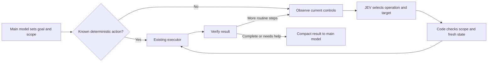

# JEV for computer use

## Finding

Yes: JEV can choose the next operation and target from observed UI controls. Existing projects
already do this in browsers and native macOS applications. The promising change is to let code
run several observe/select/act/verify steps before returning to the main LLM. Wrapping each click
in another LLM turn would retain much of the context and coordination cost we want to remove.

This is research as of September 25, 2026, based on primary documentation and public implementation
inspection. No third-party plugin was installed, no provider call was made and no benchmark was
reproduced for this research. Browser feasibility is supported; compatibility with our installed
host tools, mobile UI coverage and savings on accepted development tasks are not yet established.

## What is demonstrated elsewhere

| Primary source | Relevant implementation | What its evidence establishes |
| --- | --- | --- |
| [Browser Use: jev-ultrafast](https://github.com/browser-use/jev-ultrafast) | A fresh indexed table of browser controls supplies separate operation and compatible-target questions in one request. Code acts; a text model is called only when typing requires generated text. | Working browser implementation. Its default decision loop uses DOM text, not screenshots. Its documented reader excludes several UI classes, including frames, canvas and uploads. |
| [Jev Desktop for Codex](https://github.com/yikangy873-gif/jev-desktop) | Keeps the existing Computer Use executor. A bounded loop chooses from allowed controls, rechecks state, and uses locally prepared text slots. It returns exceptions to Codex. | Community implementation directly relevant to our host. The README reports 123 offline tests and explicitly does not establish an end-to-end speedup; observation can dominate runtime. We have not installed or qualified its adapter here. |
| [Pi Jev Browser](https://github.com/laihenyi/pi-Jev-browser) | One loop supports browser and macOS accessibility drivers. It detects stale state, lack of progress and uncertain actions. Exact supplied text can avoid another generative call. | Public implementation plus a [22-scenario author-run suite](https://github.com/laihenyi/pi-Jev-browser/blob/main/benchmarks/README.md), spanning offline, real-model, web and desktop checks. This is not a matched LLM token-savings study. |
| [Jev Browser](https://github.com/jasonduncan/jev-browser) | The agent supplies a bounded plan and existing browser tools; the runner performs multiple steps before yielding. It records observation, selection, action and total time separately. | Another continuous-runner example. A runtime-level integration is the useful idea; an instruction or skill alone does not demonstrate that ordinary tasks take this path. |

The [Browser Use measurement report](https://github.com/browser-use/jev-ultrafast/blob/main/docs/performance.md)
is unusually useful because it records failed development attempts and clock boundaries. Its
three matched pairs improved median runtime from 9.450 to 7.092 seconds; both arms already used
JEV. Much of the gain came from fewer browser protocol calls and better state checks. This is
evidence about executor design, not JEV versus a frontier LLM. Initial navigation and independent
post-run verification sit outside the reported clock. The tiny helper-model charge is not the
total task cost. Do not repeat it as such.

The Pi benchmark also describes a planning failure: direct short-goal execution lost its place,
while explicit step structure helped. Its optional JEV planning experiment only plans against
controls visible in the initial state. That does not establish general planning across changing
pages. Our first pilot should keep the task plan with the existing main model.

Inspected main revisions: Browser Use `1231850a0bf1a0c0341fe408ef1668dbbfdfac46`;
Jev Desktop `9b02783ed96a81f2529827492de708ca1956c265`;
Pi Jev Browser `206a351831d82580a78ac4635aabcc33bc7134c9`;
Jev Browser `e8649083fad5c34e8a4178cbae19fde420e010ec`.
These identify the inspected sources, not independently certified releases.

## What JEV can and cannot replace

TypeSafe's [System One contract](https://docs.typesafe.ai/concepts/system-one) currently accepts
text and structured textual state, not images, audio or video. It returns choices and judgments;
it does not generate arbitrary scripts or text. A browser DOM or accessibility tree can supply
the controls. Pixel-only screens still need a separate perception capability, which may itself
cost model tokens. Confidence is not proof that a particular action is correct.

| Job | Initial owner | Why |
| --- | --- | --- |
| Understand the goal and prepare a short plan | Existing fixed main model | Preserve broad reasoning and avoid adding another delegated model. |
| Execute a known API call, locator or fixed test sequence | Code | No semantic decision is needed. Adding JEV here can increase cost. |
| Choose among several valid controls or recognize a familiar UI state | JEV | A bounded semantic choice can replace repeated reading/reasoning by the main model. |
| Read controls and perform clicks, fills or scrolls | Existing approved executor | JEV neither owns the device nor bypasses tool permissions. |
| Supply known field values | Local caller-prepared slots | Avoid another model call and avoid sending sensitive field values unnecessarily. |
| Write new text or resolve an unexpected workflow | Same main model | Return one compact exception instead of guessing or starting another helper model. |
| Check target identity, permissions, freshness, deadlines and exact results | Code | These are execution and evidence requirements, not probabilistic judgments. |
| Diagnose a crash or decide how to change product code | Main model using collected evidence | UI action selection does not establish root cause or a correct code repair. |

TypeSafe recommends [asking related questions together](https://docs.typesafe.ai/patterns/fan-out).
For UI work, ask for an operation and its possible targets in one call, then consume only the
matching target answer. Validate the operation and selected target independently. Ignore unused
speculative answers. The [documented model limitations](https://docs.typesafe.ai/model-jaggedness/jev-1.13)
also matter: counting, arithmetic, date comparisons, indirect instructions, irrelevant state and
adversarial text are weaknesses. Keep exact facts and permissions in code. Treat UI content as
untrusted task data, never as authority to change the goal or action scope.

## Proposed first iteration

Deferred by the operator on September 25, 2026, for a later release. Retain the research and
proposal below; no plugin installation, prototype or live pilot is part of current release work.
The immediate focus is performance and reliability in existing governance adopters.

Start with automated browser smoke tests. Evaluate an existing executor before building a new
one; only add the small test-specific integration that proves necessary. Keep the current fixed
coding model. Reuse existing JEV
configuration, disclosure approval, decision receipts, task identity and cancellation where they
fit; do not build a second policy or telemetry store merely for this experiment.

### Reuse candidate: Jev Desktop for Codex

The community plugin is a plausible starting point for a Codex-hosted pilot. Its
[adapter](https://github.com/yikangy873-gif/jev-desktop/blob/9b02783ed96a81f2529827492de708ca1956c265/plugins/jev-desktop/scripts/codex-adapter.mjs)
accepts an existing approved Computer Use target and an injected decision client. It exposes
`run`, `state` and `stop` methods, allowing several actions before the main model receives a
compact result. This is a closer fit than introducing another browser controller.

It is not yet a drop-in governed test runner. The
[integration instructions](https://github.com/yikangy873-gif/jev-desktop/blob/9b02783ed96a81f2529827492de708ca1956c265/plugins/jev-desktop/skills/jev-desktop/SKILL.md)
require explicit invocation and caller-supplied scope, values and verification. Installation alone
does not route normal tests through it. Its fast loop defers login, submissions, deletion and other
consequential controls, and excludes password-manager targets. A test requiring those steps needs
the existing authorized execution path around the loop; removing these limits is not a prerequisite
for trying the plugin.

First qualify its existing implementation against the installed Computer Use API and a local test
page. Then connect its injected client and returned evidence to existing harness budgets and task
receipts. Prefer configuration and a small adapter over copied source or a permanent fork. It is a
Codex-hosted candidate, not evidence of support for Claude, unattended CI or every desktop app.

### What the targeted test tooling owns

Each reusable test supplies the target environment, fixture data, required UI interactions,
expected results and cleanup. Code performs known steps and checks exact outcomes. JEV chooses
among permitted observed controls where page state requires interpretation. The main model
prepares the test or handles an unexpected failure; routine execution should not return to it
after every click.

For example: open a test console, find a seeded record, change a permitted setting through the UI,
reload, and confirm the saved value. The test must require the UI change even if an API could make
the same edit. APIs may prepare fixtures or independently verify persistence. They must not replace
the UI interaction under test. Nor may JEV change the expected result, choose a different record,
or work around a product defect and report the original test as passed.

Record an assertion failure, an automation failure and an authentication/environment prerequisite
failure separately. Keep the original failed attempt when recovery is needed. Bind verification
to the expected project, environment and fixture identity, not merely a success message somewhere
on the screen. Any uncertainty after a submission requires readback before another mutation.

Credential retrieval is a setup concern, outside the JEV action loop. For 1Password, prefer approved
secret references and local execution: its [CLI supports resolving references into a subprocess](https://www.1password.dev/cli/reference/commands/run),
and [service accounts](https://www.1password.dev/service-accounts) can restrict vault access. The
executor receives the required secret or authenticated session; neither decision model needs the
secret value. Keep values out of model requests, screenshots and receipts. Existing interactive
authentication remains applicable when required; no service account or account access is implied
by this proposal. Start the pilot with non-sensitive fixtures and an already prepared session.

Expose the loop through one ordinary governed workflow/tool call. A skill can explain how to use
it, but cannot prove adoption or make per-click model mediation disappear. Record eligible runs,
actual loop entry, JEV selection, deterministic fast paths and fallback separately; enabled flags
alone are not usage evidence.

The request would carry the approved app/tab, goal, completion condition, allowed operations,
prepared text slots, and step/time/spend limits. Code enumerates current valid controls. Do not
offer hidden, disabled, unsupported or unauthorized actions. This is an execution boundary, not
an LLM relevance shortlist. Include the full eligible observed control set within the provider's
limits; report incomplete coverage and use bounded paging/expansion or return for help. Never
silently truncate to the first convenient controls and claim complete selection.

Each chosen action refers to an observed element identity. Before acting, recheck the target and
the state relevant to that action. Unrelated animations should not necessarily invalidate it.
After acting, inspect the result. Stop on repeated no progress, uncertainty, missing credentials,
deadline exhaustion or an unknown mutation outcome. Never retry an uncertain click or submission
blindly. Missing-token fallback returns useful state to the ordinary main-model workflow without
restarting completed actions. Existing authorization still governs consequential actions.

Return a compact outcome with completed steps, last known state, exception reason and references
to the full local trace. Keep raw observations and screenshots out of the main model's input
unless diagnosis or final visual verification needs them. A JEV `DONE` answer is only a request
to verify completion, not evidence that the task succeeded.

## Pilot priorities and proof

1. Evaluate Jev Desktop on one local browser smoke flow with realistic branching controls,
   prepared values and exact postconditions. Verify live host compatibility and real JEV calls;
   do not treat the author's tests as our local proof. Include a deliberately broken result to
   establish that the test fails correctly.
2. Add one real project's repeatable web-console smoke test through the normal governed workflow.
   Use existing authorization for any fixture mutations, independent outcome checks and owned
   cleanup. Measure whether the main model actually avoids intermediate reading and decisions.
3. Defer general information lookup, password-manager UI traversal and broad desktop automation.
   Native desktop or simulator navigation follows only after proving the executor exposes the app's
   controls. A simulator window is not proof that its guest app has usable accessibility data.
   Physical-device control needs its own supported adapter and qualification.

Compare the existing fixed-model workflow, deterministic automation where applicable, and the
bounded JEV loop on the same small set of tasks and acceptance checks. Include missing keys,
stale controls, changing pages, a wrong target with high confidence, unavailable UI structure and
an interrupted mutation. Keep failed attempts and recovery time.

Measure main-model turns and input/output tokens, JEV requests/usage, observation/action time,
total elapsed time from the request, independent outcome verification, extra reads, fallback and
rework. Include setup, planning and final verification in the end-to-end comparison. Provider
tokens are not all priced alike; report model-specific usage and known billed cost separately.
Fewer main-model tokens only count as a benefit when accepted outcomes remain at least as good.

## RC8 recommendation

Ship the [shared-hook reliability repair](../specs/engine-rc8-hook-sources.md) as the confirmed fix.
The browser pilot is deferred to a later release. Do not bundle an unqualified desktop controller into RC8
on the strength of demos. Reuse the control-loop design and evaluate compatible adapters before
choosing a dependency; this research does not endorse installing the referenced community code.
