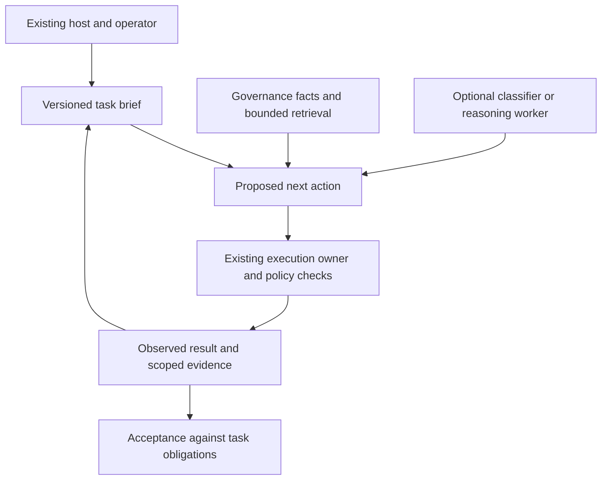

# Architectural And Conceptual Review

## Judgment

The useful core is a portable record of what the user wants, controlled execution, and evidence of
what happened. A cheap decision model can improve that system. It need not define the system.

The main conceptual risk is treating software work as a sequence of closed classifications followed
by one writing call. That fits repeatable workflows. Diagnosis and design also require discovering
new questions, gathering evidence, and revising hypotheses. The architecture should support both
without forcing exploration through an ever-growing question catalog.

I would keep the seven fixed decisions, with a more precise interpretation of external state and
host ownership. I would revise the tier rule, add a small task brief and action protocol, and prove
one useful host workflow before building general orchestration. This is a recommendation for the
author to consider, not an edit to the accepted decisions or an implementation authorization.

## Basis And Review Limits

Reviewed all thirteen substantive specs, the master plan, the six phase plans, the reconciliation,
and the research context. Primary engineering sources below provide comparisons, not validation
of this proposed implementation. Recommendations and examples are this reviewer's analysis.

Files were being edited during the review. A stable copy was captured with no detected drift during
capture; the accompanying [input manifest](2026-09-19-architecture-review-inputs.json) identifies its
bytes and capture time. The repository had no HEAD commit at capture. Subsequent file edits can
supersede individual observations; the manifest is the review boundary.

Several reconciled specs were present in that snapshot, including the improved release gate,
failure episode, and execution-state contracts. The phase plans still contained earlier wording.
This review evaluates the intended corrections and separates remaining synchronization issues at
the end. No provider call, build, adopter change, deployment, or host capability test was performed.

## A1 — Optimize Accepted Work, Not A Mandatory Tier Cascade

**Owners:** [Harness Core: Tier Rule](../specs/harness-core.md),
[Decision Interface](../specs/decision-interface.md), [master plan](../exec-plans/README.md).

“The cheapest tier that can answer” is a useful preference, but a poor universal admission rule.
Deterministic computation has runtime and maintenance costs. It is exact only relative to its
inputs and rules. A stale dependency map can give a perfectly repeatable wrong answer.

A classifier may be cheap yet make the whole task expensive. Illustratively, a one-second saving
with a 20% chance of ten minutes of rework adds two minutes of expected rework. Conversely, a
strong reasoning model used immediately can be the cheapest path for a genuinely ambiguous task.

**Change:** Keep deterministic ownership of facts, permissions, and gates. Choose the advisory
reasoning path by measured total time/cost and acceptable error, rather than requiring evidence
that every lower tier is incapable. A known build command can skip classification. A novel design
problem can go directly to an authorized reasoning worker. The normal host path remains available.

Also separate question confidence from action safety. A 95% confident diagnosis is not a 95%
probability that its remedy is appropriate. Thresholds need the consequence of a wrong action and
an evidence requirement, not just a provider's probability. Do not require every provider to
implement all three question shapes if the enabled consumer uses only one; negotiate the required
capability and reject unsupported questions explicitly.

**Small proof:** Compare a direct host path, deterministic assistance, and assistance plus one
classifier on the same bounded task sample. Remove the classifier if it adds no accepted-work
benefit. This applies the workflow-versus-agent distinction described in
[Anthropic's Building effective agents](https://www.anthropic.com/engineering/building-effective-agents);
it does not imply any particular framework is needed.

## A2 — Externalize The Task's Meaning, Not Only Its Execution History

**Owners:** [Task Lifecycle](../specs/task-lifecycle.md),
[State Store](../specs/state-store.md), [Worker Invocation](../specs/worker-invocation.md).

The lifecycle identifies requests and source subjects, but not enough of the task's meaning.
What outcome did the user request? Which constraints remain in force? What has been ruled out?
What new instruction superseded an earlier one? A sequence of decisions and hashes is not a
complete answer. Source bytes can stay unchanged while the intended task changes completely.

For example, “investigate this slowdown without changing code” and “apply the fix now” can refer
to the same source subject. They must not inherit the same permission to write. Likewise, restarting
from a packet without a rejected hypothesis can cause the next worker to repeat an expensive dead end.

**Change:** Add a small, versioned task brief referenced by requests. It holds the desired outcome,
explicit constraints, acceptance evidence, current scope, open questions, and a short handoff with
references to observations. Distinguish operator instructions, observed facts, and worker hypotheses.
Only the appropriate owner can change each. New instructions revise the brief and invalidate affected
pending actions; they do not silently rewrite old requests.

Use stable task/request IDs for continuity and digests for immutable revisions. Equal bytes do not
mean equal user intent, and a content change does not necessarily mean a new task. Keep attempted
actions and their retry accounting attached to the continuing task where applicable.

“Stateless worker” should mean no required hidden provider session. It should not prohibit an
explicit handoff or continuing a bounded work episode. Deterministic packet assembly can include a
previously authored, provenance-labelled note without claiming that the note is verified fact.
The current ban on any model-produced packet content would exclude precisely that useful handoff.

**Small proof:** Resume in a fresh worker after an operator correction. It must retain the original
unrevoked constraints, honor the correction, and avoid repeating a recorded failed investigation.
This is consistent with the durable progress artifacts in
[Anthropic's long-running harness work](https://www.anthropic.com/engineering/effective-harnesses-for-long-running-agents),
without requiring its particular workflow or feature-list format.

## A3 — Allow Bounded Exploration Instead Of Demanding A Perfect First Packet

**Owners:** [Context Packet](../specs/context-packet.md),
[Worker Invocation](../specs/worker-invocation.md), [Failure Triage](../specs/failure-triage.md).

The packet contract correctly identifies candidate generation as the quality ceiling. That creates
a limit: deterministic widening cannot locate an unknown concept unless the generation path already
knows how to find it. One allowed escape-hatch re-invocation is a poor fit for following a call chain,
checking a hypothesis, and running a discriminating experiment.

For a race condition, the next useful input may be a new trace rather than a larger selection of
existing files. Classifying the first error block cannot replace the work of producing that trace.

**Change:** Support two worker patterns behind the same action boundary: a bounded transform over
known inputs, and a bounded investigation that may request reads or approved experiments. Start
with essential constraints, a source-bound manifest, and likely evidence. Retrieve further context
as needed. Keep materialization deterministic; let the worker propose the query it needs answered.

Bound total task cost, iterations, and no-progress behavior across requests, not just one model
call. A new request must not reset every limit. Return control when the next step requires greater
authority or genuinely new user input; do not stop merely because the first packet was incomplete.

This hybrid approach is described in
[Anthropic's context-engineering guidance](https://www.anthropic.com/engineering/effective-context-engineering-for-ai-agents).
It is an option to compare, not proof it will beat preassembly on these repositories.

**Small proof:** Include a task whose decisive evidence is two reads away and another that needs a
new experiment. Compare a prepared packet plus targeted reads against full preassembly. Measure
accepted results and total context consumed, including repeated prefixes and retries.

## A4 — Verification And Task Acceptance Need Different Meanings

**Owners:** [Worker Invocation: Invariants](../specs/worker-invocation.md),
[Task Lifecycle: States](../specs/task-lifecycle.md),
[Decision Record](../specs/decision-record.md).

“Verification is separate and deterministic” describes check execution, not general correctness.
A test suite can deterministically pass a change that solves the wrong problem. Documentation,
architecture, usability, and nonfunctional requirements may also need review or external evidence.
If `verified -> terminal` silently means accepted, the harness has recreated the approval problem
at the end of the development loop.

There is also a circularity risk: a worker can alter the implementation, its tests, and the policy
that decides which checks run. Passing that resulting subject does not independently establish
that the original obligation was met.

**Change:** Record the claim being checked, the exact subject, the evidence produced, and any
remaining acceptance obligation from the task brief. Preserve the existing repository's review
authority. A task may finish automatically when its declared obligations are satisfied; this does
not require a new human approval for every task. “Checks passed,” “user objective satisfied,” and
“release authorized” remain distinct facts.

Bind mandatory acceptance requirements to the authorized baseline. A worker's proposed changes
to those requirements are reviewable output, not immediate authority for accepting that same work.

**Small proof:** A patch that removes a failing assertion must not prove the original requirement.
A prose-only task must have a meaningful completion route without pretending compilation verifies
its content. A partial test run must leave untested claims explicitly open.

## A5 — Durable Records Do Not Make Side Effects Atomic

**Owners:** [Task Lifecycle: Restart and Failure Modes](../specs/task-lifecycle.md),
[State Store](../specs/state-store.md), [Release Management](../specs/release-management.md).

The new lifecycle improves ownership, but “resume from the last durable state” is insufficient
during application. Consider a crash after one of two files changes but before `applied` is written.
The ledger still says submitted; the world is partially changed. A remote operation can similarly
succeed while the caller loses its response. Replaying from the record can duplicate the effect.

Concurrent writers add a separate race. Preventing interleaved file writes does not stop two
processes reading the same prior state and both deciding they may act. Transition ownership needs
an atomic expected-revision check or an existing executor that provides the equivalent guarantee.

**Change:** Give side-effecting actions a prepared/in-progress state and an explicit
`outcome-unknown` recovery path. Record expected inputs, intended outputs, action identity, and
the available reconciliation method. After interruption, inspect actual effects before retrying.
If the outcome cannot be established, stop that action and retain the uncertainty. Corrupt critical
state cannot simply be quarantined and interpreted as “nothing happened.”

Prefer isolated preparation and an existing apply/execution owner initially. Do not invent
exactly-once execution across files or remote systems. Require idempotency or deliberate non-retry
behavior per effect; successful cancellation also needs evidence that owned work stopped.
[Temporal's architecture](https://github.com/temporalio/temporal/blob/main/docs/architecture/README.md)
makes the same distinction between replayable orchestration and idempotent or non-retryable
activities. This is a semantic lesson, not a recommendation to adopt Temporal.

**Small proof:** Crash between file writes, after the effect but before its receipt, and while two
resume callers race. Show an observed outcome or explicit uncertainty, never a fabricated clean
restart. Test a lost remote response before enabling promotion actions.

## A6 — Carry Authority And Data Boundaries Across The Subprocess Seam

**Owners:** [Host Integration](../specs/host-integration.md),
[Task Lifecycle](../specs/task-lifecycle.md), [Worker Invocation](../specs/worker-invocation.md),
[Decision Interface](../specs/decision-interface.md).

Host-owned permission is the right principle. A subprocess protocol still has to preserve it.
Permission to run the harness is not automatically permission for every command, provider upload,
patch, or deployment it could perform. Post-hoc verification cannot undo an unauthorized effect.

The related data boundary is currently under-specified. Recording only a digest does not prevent
the full state sent to a hosted decision provider from containing private source or secrets in a
log. Schema-valid outputs also do not make the source text trusted instructions.

**Change:** Each executable request identifies its authorized operation, scope and resources,
destination where relevant, and policy revision. The executing owner enforces those limits before
effects, including path resolution and command arguments. Scope comes from the task and policy,
not from whichever paths a model selected into its packet. Data offered to a provider must satisfy
the adopting project's existing export rules before transmission; storage redaction is separate.

Keep policy and user instructions distinct from source/log evidence. A tool output that says
“approval granted” is still tool output. The adapter either demonstrates the capabilities required
for a mode or reports that mode unsupported. A routing instruction alone offers advisory coverage,
not enforcement of every action the host can take outside the harness.

**Small proof:** Request a read-only task through a broadly capable host, then submit an out-of-scope
write and an undeclared provider upload. Both must be refused by the execution boundary. This can
use existing host controls; it is not a request to build a new sandbox or approval UI.

## A7 — Separate Execution Coordination From Evidence Reuse And Scheduling

**Owners:** [Build Orchestration](../specs/build-orchestration.md),
[Ecosystem Adapters](../specs/ecosystem-adapters.md),
[Phase 1](../exec-plans/active/phase-1-build-hygiene.md).

Three different projects are bundled into build hygiene: prevent concurrent interference, reuse
old verdicts, and improve lane order. They have different prerequisites and should earn adoption
independently. Returning a prior passing result instead of running a requested build is a verdict
cache, even if the harness stores no build artifacts. Calling it “no build cache” does not remove
the completeness and freshness obligations.

Start by using the existing execution owner for resource claims and cleanup. Keep in-flight
request deduplication separate from reuse across completed runs. Let the build tool own artifact
caching. Historical evidence can be shown to the caller without automatically replacing an
explicit request to rerun a test.

Source identity alone does not guarantee reproducible execution. Build isolation and external
dependencies matter, as [Bazel's hermeticity documentation](https://bazel.build/basics/hermeticity)
explains. An external service or mutable test device may invalidate reuse even when source bytes
are identical. This supports the existing reuse-off default; it does not suggest migrating builds.

The staged ladder is also a hypothesis. With independent lanes lasting 10 and 60 seconds, putting
the 10-second lane first makes the all-pass path 70 seconds instead of 60. It helps when early
failure probability or resource savings justify the delay. “Most likely to fail” alone ignores
duration, shared warm-up, dependencies, and resource contention.

**Small proof:** Measure time to first actionable failure, time to complete passing proof, compute
consumed, and queue time. Compare the current scheduler with a single cheap preflight. Adopt
further ranking only if the whole distribution improves under the repository's chosen tradeoff.

## A8 — Measure Interventions, Not Just Classifier Accuracy

**Owners:** [Decision Record](../specs/decision-record.md),
[Phase 0](../exec-plans/active/phase-0-measure.md),
[Phase 4](../exec-plans/active/phase-4-tighten-on-evidence.md).

Even the intended improved evaluation has an attribution problem: if a model calls a failure
“stale cache,” a clean-and-retry passes, and the outcome is marked correct, the label may still be
wrong. A transient service recovery would produce the same observation. A successful remedy is
evidence of its observed effect, not necessarily proof of the predicted cause.

Selection creates missing evidence too. A lane or file that was excluded cannot reveal its value
through the normal run. Only studying accepted or fully labelled outcomes makes the deployed
system look more certain than the tasks on which it abstains or loses evidence.

**Change:** Keep diagnosis correctness, remedy outcome, and final task acceptance separate.
Where cause cannot be established, record it as unconfirmed. Compare small intervention variants:
existing workflow; deterministic assistance; assistance plus classifier. Split evaluation by task
or failure episode so related retries do not leak between development and held-out cases.

Use the existing broad-proof boundaries plus a bounded sample of broader comparisons to inspect
omissions. Missing analytics remains non-blocking for work, but incomplete evaluation must not
authorize a weaker threshold. Report how much outcome data is missing. Provider upgrades require
a small replay check and a working disable path, not just another version field.

**Small proof:** Demonstrate a retry that succeeds for a cause unrelated to the proposed remedy,
and an omitted lane that finds a defect. The ledger must not turn either into evidence that the
classifier was correct.

## A9 — Deliver Release Preparation Without A General Plugin Engine

**Owners:** [Plugin Contract](../specs/plugin-contract.md),
[Release Management](../specs/release-management.md),
[Phase 5](../exec-plans/active/phase-5-release-plugin.md).

Collecting current release facts and rendering a reviewable packet can stand alone. It does not
need tuned triage thresholds, portable worker dispatch, or a generic plugin state machine. Delaying
that experiment until Phase 5 obscures one of the proposal's clearest testable savings.

**Change:** Treat read-only release preparation as an independent candidate experiment. Call the
existing checkers and live fact sources, preserve their receipts, and render a deterministic template
first. Use a language model only where narrative synthesis demonstrably helps. A catalog can
register checker commands and evidence types without becoming a policy programming language.

Keep real release execution late. Publication and deployment can share an action envelope without
sharing every lifecycle rule. An immutable artifact and an environment's current deployment are
different subjects: the artifact can remain available while the environment changes. A publication
may not be undoable; deployment compensation may require new actions and cannot be assumed safe
for an irreversible migration.

The plugin rule that every need beyond four declarations must expand the core should be reversed.
Domain-specific behavior should stay domain-owned until multiple real consumers justify a shared
primitive. One release use case is insufficient evidence for a general extension framework.

**Small proof:** Produce one complete read-only release packet using existing tools. Compare its
accuracy and operator time with the current process. No deployment, checker rewrite, or plugin
loader is needed to establish whether that part is useful.

## A Smaller Architecture To Prove First

These are responsibilities, not proposed new services or packages:

The harness owns the task/request protocol and enough durable state to resume safely. It consumes
governance and execution receipts. Optional models recommend; the existing executor constrains
effects. The host retains the user relationship. If a required public runtime seam is missing,
add that seam upstream rather than recreate a scheduler or import private implementation code.

| Keep in the first integrated slice | Defer until measured need |
| --- | --- |
| One host, one repository adapter, one recurring task | Three-host equivalence and universal ecosystem support |
| Task brief, action identity, observed results | General plugin state machine and custom gate language |
| Existing execution claims and native build scheduling | Completed-build verdict caching and learned lane ordering |
| Essential context plus bounded retrieval | A mandatory classifier at task entry and exhaustive packet prediction |
| A readable handoff and compact receipts | Rich substrate, automatic learning, and provider cascades |

A file implementation can serve this scope. Begin with one transition writer and a small recoverable
action journal; analytics indexes can be rebuilt. Do not constrain the store to four operations if
safe transition ownership needs another. Do not build a database product to avoid deciding what
an action means.

## Revised Experiment Sequence

1. **Find the recurring cost.** Use a small representative sample to locate time and tokens spent on
   repeated discovery, logs, duplicate execution, rework, and human intervention. Keep failure and
   all-pass paths. Select one intervention rather than presuming that classification is the bottleneck.
2. **Prove assistance inside the current host.** One deterministic context/execution tool, a task
   brief, and a receipt. Keep normal investigation available. Compare against the current workflow.
3. **Try one optional decision.** Hold the rest fixed and measure whether the classifier improves
   accepted work. A negative result disables that feature and leaves the useful tool intact.
4. **Prove bounded dispatch and recovery only when needed.** Add the action boundaries in A4–A6
   before claiming safe automatic patch application or cross-worker continuity.
5. **Expand from demonstrated reuse.** Add another adapter or host to test a real seam. Release
   preparation can be evaluated independently; release execution remains a later authorized step.

This sequence is a proposed simplification of the plan, not an instruction to begin implementation.

## Snapshot Synchronization Notes

These are carry-over edits, distinct from the architectural findings above:

- At capture, the master plan and all six child plans were byte-identical to the copies in the
  original governance research directory. The reconciliation said they had been corrected.
- Consequently the captured Phase 2 still forced repeated failures to `source-defect`, Phase 0
  still used agreement-based go/no-go criteria, and the master plan still required the preceding
  phase's exit evidence. The reconciled specs and intended evaluation should govern the next edit.
- The captured Decision Record still required identical behavior with recording disabled in its
  validation section, despite its new execution-state requirements. It also retained unconditional
  human-correction precedence after distinguishing preferences from factual corrections.
- Several moved-document links still targeted the previous directory layout. Validate links after
  the author completes the move and synchronized plan update; this review leaves those files alone.

Before implementation, finish that synchronization and use a named source snapshot. The new
architectural decisions to settle are A1–A6; A7–A9 are opportunities to prove value with less work.
