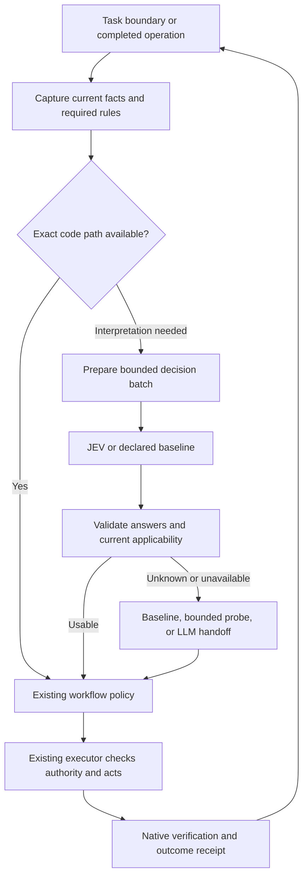

# Development engine decision layer

## Purpose and status

This specification is for engine implementers and reviewers deciding how to remove repeated model
reading and coordination from development. It defines the shared contract. The
[use-case specification](engine-decision-use-cases.md) defines consumers and their acceptance
criteria; the [integrated implementation plan](../exec-plans/active/2026-09-21-major-adoption-and-measurement.md)
owns delivery and progress, with [technical packages](../reference/2026-09-20-decision-layer-work-packages.md)
as supporting detail. The [local-CI decision specification](engine-decision-local-ci.md)
expands check selection, reuse, resource-aware execution and adaptive validation. The
[RC3 experiment specification](engine-decision-experiments.md) scopes attention routing,
read-only diagnostic sequences and offline history analysis. The
[RC4 specification](engine-decision-rc4.md) extends quality evaluation, optional model routing,
required governed delegation for the pilot and CI advice within the same owners.

**Proposal, not activated policy.** Authoring these documents does not enable a provider, install a
host integration, change a required check, or expand an existing action grant. The
[unified engine](unified-development-engine.md) remains the implementation baseline. The RC3 source
implements ten optional consumers and the qualified DL05 read-only effect. Other effect extensions
below remain proposals until implemented, qualified and deliberately enabled.

The intended result is a development loop that uses code for exact facts, JEV for bounded judgments,
and a larger model for unfamiliar reasoning and code generation. Qualified judgments may select
already permitted actions. Permission, required proof, execution, and acceptance retain their owners.

## Current starting point

The `3.0.0-rc.3` source implements DL01–DL07, DL09, DL12 and DL13 through `decision-runtime.ts`
and registered callers. The retained `decisions.ts` adapter supports deliberate legacy context
migration. Required execution remains deterministic. DL04/DL07 return recommendations; DL05 can
also select up to three preauthorized read-only probes through explicit `workflow-diagnose`.
DL06 is attention advice; DL12 is on-demand history analysis. DL03/DL13 shape optional input text.
DL08 model routing is not implemented. No measured savings or live adopter qualification follows
from source presence.

The earlier [E3 evaluation disposition](../reference/2026-09-20-e3-evaluation-disposition.md) records
inconclusive benefit for its context question, not a verdict on the wider layer. The
[RC3 experiments](engine-decision-experiments.md) extend existing consumers; broader proposals
below remain capability ceilings, not silently activated behavior.

## Goals and scope

- Replace identifiable LLM turns, repeated broad reads, and recurring workflow choices.
- Improve test quality, coverage discovery, evidence interpretation, and release preparation.
- Reduce time to useful feedback and accepted completion without hiding defects or required proof.
- Support local, VM, and hosted CI through the same question and result contracts.
- Keep JEV preferred, optional, and replaceable behind one interface.
- Preserve enough evidence to measure errors, avoided work, fallback, and rework over time.

This does not create a second scheduler, policy engine, release controller, vector database,
provider marketplace, or autonomous procedure installer. JEV does not generate fixes or commands.
The layer is a TypeScript module within the single engine distribution. Optional consumers register
through the [capability boundary](engine-capability-boundaries.md); they are not separate runtimes.

## Responsibilities

| Owner | Responsibility |
| --- | --- |
| Governance and project declarations | Applicable rules, required evidence, allowed effects, supported workflows, release authority |
| Existing engine | Current facts, source identity, resource ownership, execution, durable transitions, result validation |
| Decision consumer | A specific recurring question, evidence preparation, baseline, interpretation, permitted effect, outcome metric |
| Decision layer | Typed requests, provider routing, bounded calls, answer validation, fallback, receipts and qualification identity |
| JEV adapter | Translate supported question primitives and preserve their native distinctions |
| Coding/review LLM | Novel investigation, architecture, implementation, substantive explanation, unresolved judgment |
| Project adapter | Actual commands, scenario catalog, device observations, build relationships, release inputs |

Machine rules have one accepted declaration/code owner under the [charter](../../CHARTER.md).
Question wording describes a judgment; it cannot rewrite a machine rule. Existing checkers must not
start invoking models implicitly because a new decision consumer is installed.

## Execution model

Evaluate on meaningful changes: a new request, captured diff, completed probe, or completed job.
Do not query on each log line or poll a healthy job merely to obtain another judgment. Coalesce
duplicate events using source/event identity. A dependent probe produces a new snapshot and request.

### Modes and effect limits

Keep the existing `off`, `shadow`, and `auto` vocabulary. Effect limits are separate from modes.

| Setting | Meaning |
| --- | --- |
| `off` | No provider transport; consumer uses its declared baseline |
| `shadow` | Record advice for comparison; deliver and execute only the baseline |
| `auto` | Consume qualified answers up to the resolved effect limit |
| `observe` effect | Evaluation and offline analysis only |
| `advise` effect | Return findings, context, or a proposed route to an existing caller |
| `shape-plan` effect | Order eligible work, select optional checks, or defer within a declared budget; preserve required proof |
| `request-input` effect | Ask through a supported caller interface when an unresolved decision needs operator input; no new approval requirement |
| `choose-read` effect | Select among eligible read-only probes or registered read workflows |
| `choose-local` effect | Select a specifically granted local workflow or recovery operation |
| `route-model` effect (RC4 proposal) | Select an eligible model/effort pair within one already authorized new provider assignment; no delegation or live-session switching authority |

Scoped worker steering is a registered control operation under `choose-local`, using the existing
worker owner and its authority. Returning advice to the caller does not grant permission to message
or interrupt another worker. Selecting build/test operations also uses existing execution authority;
read-only inspection of a plan is distinct from running its commands.

The [attention experiment](engine-decision-experiments.md#a--attention-routing) initially uses
shadow/advice only. A future live delivery effect needs separate qualification; no `route-attention`
effect is added to the next RC schema.

Effects are explicit allowed capabilities, not a ladder of permissions. Granting `choose-local`
does not implicitly enable operator prompts or plan shaping. A shaped plan still passes existing
execution admission; selecting optional work cannot authorize its commands. `request-input` is
opt-in, deduplicated and rate-bounded. It never reopens an already settled permission, silently blocks
completion, or turns a missing provider into an approval queue. Headless callers receive advice or
their existing unresolved-state handling, not a fabricated answer.

The default for new questions is disabled; enabled new consumers initially permit advice only.
Global disable always wins. An existing `auto` profile must not acquire `choose-local` permission
through upgrade. Effective capability is the intersection of consumer qualification, profile effect
limit, current operation eligibility, and existing action authority. No model score grants authority.

Commands that may persist optional decisions require managed write admission even when their
native operation only observes or plans. `plan`, `provider-status` and `provider-wait` therefore use
conservative write classification. This applies even with advice disabled; generation rollback may
be refused after such an invocation. Do not read a mutable profile ahead of admission to guess the
effect. Native operation authority and result are unchanged by this classification.

### First-RC configuration and aggregate budget

Extend the existing `continuity.decisions` owner with
`consumers.<DLxx>.{mode,effect?}` and `budget.{max_calls,max_request_bytes}`.
`max_request_bytes` is the cumulative serialized request-byte allowance for one task revision
(default 131,072), shared across consumers; it is not multiplied by `max_calls`. Each individual
request also has a fixed 65,536-byte ceiling. Exhausting either cumulative allowance returns baseline. Consumer IDs, keys,
modes and effects are strictly validated. The existing top-level `mode` is the global ceiling:
`off` prevents every call, `shadow` prevents every delivered semantic effect, and `auto` permits
each explicitly configured consumer mode. New consumers default off. All eight RC1 consumers use
the existing `advise` effect; for DL03/DL13 this includes shaping optional caller text, never the
required packet, native result or executable plan. “Enabled” means `auto` at that effect, not a new
mode. Shadow records the suggestion but preserves baseline delivery, including for advice consumers.
An omitted consumer `effect` resolves to `advise`; first-RC setup needs only each feature's mode.
Doctor and receipts show the resolved effect. An explicit effect is strictly validated against the
consumer's supported capabilities. The omitted-field default stays advice in future versions;
new execution effects require explicit configuration and qualification, never an upgraded default.

RC4 adds DL08 and explicit per-consumer question allowlists under the
[RC4 contract](engine-decision-rc4.md#configuration-and-legacy-migration). An omitted question list
preserves the RC3 definitions for an existing consumer; it does not activate new quality/CI questions.
An enabled routing consumer also needs the explicit `route-model` effect for live selection.
Fixed-model operation remains the default. When opted in, JEV classifies into operator-defined task
categories and code applies their fixed model/effort mappings; it does not search or rank models.
The [required-governed boundary](engine-decision-rc4.md#required-governed-delegation-and-feature-exposure)
binds actual route and override authority at the host, not through agent-written model arguments.

Migrate an old profile's `mode`/`allowed_questions` into only its existing E3 context behavior:
DL03 may retain `rank_optional_context` and the old data, source and request limits if previously
allowed. The old `rank_diagnostics`/`advise_intent` permissions do not enable DL05/DL04 or any new
question. Retain their prior adapter meaning only where an existing caller used it; no new caller
inherits it. New question sets require explicit configuration even inside DL03. Resolve old and
new settings once into the canonical configuration; conflicting declarations fail validation.
Do not retain two live adapters or silently broaden a migrated allowlist.

Aggregate budgets cover a **workspace namespace plus task ID and task revision**, across consumers
and CLI processes. Existing host/caller integrations automatically carry their authoritative task
and revision through the invocation context; do not ask the LLM to repeat already bound identity.
Use ledger/job bindings where available. Explicit `--decision-task` and `--decision-revision`
arguments remain for manual/unbound entry where the public CLI lacks that binding. Reject conflicts
with an authoritative binding. Do not introduce a project-global current task, infer identity from
prose, or add a session manager. Context-route's existing `--task` is prose, not
a durable task ID. For `context-route`, reuse existing `--revision` and add only `--decision-task`;
do not add a competing revision argument. A legacy invocation without a bound or explicit task ID deliberately
falls back with `scope-unavailable`, even if its migrated E3 question remains enabled. Document that
migration effect and the updated invocation; profile compatibility does not imply an unscoped call.
A ledger-bound caller rejects conflicting explicit identities. Missing scope
returns `scope-unavailable` without inference; never invent a fresh scope for each command or poll.
Task IDs/revisions come from the owning caller, not model output, and cannot be changed merely to
replenish a spent budget. Provider-job/run IDs remain receipt join keys within this shared scope.

The existing decision module owns a bounded SQLite store, `decision-budgets.sqlite`, under
`contextStateRoot(workspace)`, using the engine's existing `node:sqlite` technology. This is the
sole live budget owner: no JSON budget backend, custom lock-file protocol or second runtime service.
Keep it independent of workflow-ledger creation so standalone context callers need no fabricated
task. Existing task/evidence stores and provider-health ownership retain their current roles.
Workspace is the caller's canonical project-root realpath:
the captured recipe's workspace for workflow observations, the bound job workspace for provider
reports, and the resolved project root for check/plan/context. Do not substitute a worker directory
or arbitrary current directory; the same task's consumers must reach the same namespace.
Atomically check and reserve calls and serialized provider-request bytes in one short SQLite write
transaction; commit before transport and never hold a transaction during provider I/O. The schema
binds scope counters and unique reservation/event identities so concurrent processes cannot spend
the same remaining allowance or dispatch a duplicate event. Use bounded lock contention within the
caller deadline; unavailable/incompatible storage returns ordinary fallback without destructive
reset. Reuse storage helpers where useful; no second persistence implementation is needed.
Proposed pilot defaults are 16 calls and 131072 request bytes per scope, configurable through
the same validated owner. Per-request deadline, byte, candidate and cancellation limits still apply.
Shadow calls and failed/timed-out dispatched calls consume the reservation. An ambiguous/crashed
reservation is not refunded automatically. Repeated observations of the same decision event reuse
its retained receipt or baseline; polling does not issue another request or reset the counter.
A crash before commit consumes no reservation and sends no request; a committed reservation remains
spent after a crash, including uncertain delivery. Recovery never guesses that the provider was not
called. Retain event identities for the same scope lifetime as counters; bounded pruning applies
only after the owner closes a scope, without making an old identity spendable again.

First-RC implementation uses a conservative 8 MiB database cap and 512 active scopes. Closed
identities remain retained; automatic compaction is not yet implemented. Doctor exposes store bytes,
capacity and the retention policy. Exceeding the cap returns ordinary `budget-unavailable` fallback.
Do not delete the store as routine recovery: that would erase spending history. Safe retention must
preserve closed identity tombstones and duplicate-event guarantees before adoption at higher volume.

On exhaustion return ordinary delivery with `budget-exhausted`; on busy/corrupt/unavailable storage
return `budget-unavailable` without transport. Record these when telemetry storage is available;
telemetry failure cannot bypass the budget or interrupt native work. Retention is bounded, but
active scope counters are not silently evicted/reset to admit more calls. If capacity is unavailable,
fall back. This small accounting owner does not schedule tasks or grant execution authority.

## Typed request contract

Use an explicit next schema version for the expanded request/response. Field names below are the
proposed wire vocabulary; implementation must ship one schema owner and derive validation from it.

| Field | Required semantics |
| --- | --- |
| `schemaVersion`, `requestId` | Contract version and unique invocation identity |
| `consumerId`, `consumerVersion` | Registered caller and exact implementation identity |
| `scope` | Repository/workspace namespace, task and task revision; run/attempt when applicable |
| `subject` | Immutable evidence snapshot digest, source revision, and relevant environment generation |
| `evidence` | Bounded declared fields and source references with digests, ranges, provenance and trust class |
| `coverage` | Captured scope, omitted candidates/fields, truncation, unavailable observations and reasons |
| `questions` | Named versioned question instances; each declares its shape, supplied options/rubric and input layout |
| `eligibilityDigest` | Required for operational consumers: identity of candidate workflows/actions and code-produced eligibility facts; explicitly inapplicable for pure advice |
| `policyDigest`, `configDigest` | Policy interpretation and resolved settings used by this caller |
| `budget` | Deadline, cancellation, question/candidate count, bytes, token estimate and method, per-request and group call/token/concurrency limits |

Keep request identity, evidence digest, provider payload digest, and policy/configuration identity
distinct. The original subject and the exact transmitted bounded payload must both be attributable.
Do not treat a digest of a larger unseen input as proof that the model evaluated all of it.

Evidence capture applies path/data-sharing scope to every text-bearing field, including purpose,
task text, criterion descriptions and diagnostics. Labels are not a way to bypass source restrictions.
Raw credentials are excluded. Project secrets remain available only to the executor that needs them.
Untrusted source/log content remains quoted evidence, never instructions or executable configuration.

Quoting is not an injection defense supplied by the model. Qualify adversarial source/log cases as
well as ordinary mistakes. Native applicability and action checks remain independent of JEV output.
An optional `evidence.suspicious-content/1` question may trigger abstention, but a low value cannot
certify safe content, bypass redaction or authorize execution. Do not make this model judge its own
trustworthiness as a prerequisite to every call. Preserve suspicious material as evidence under its
existing owner even when semantic consumers decline to interpret it.

### Question definitions

Each registered definition contains an ID, semantic version, owner, purpose, exact instructions,
answer shape, eligibility/preparation function, minimum evidence, applicable qualification, baseline,
effect ceiling, and metric. Changed meaning or evidence preparation creates a new definition identity.

Definitions are shipped reviewed data plus registered code, or explicitly trusted project extensions.
An arbitrary candidate diff cannot register questions or load code into a privileged controller.
Use a normal typed catalog; do not build a question language or general workflow DSL in this phase.

| Shape | Answer semantics | Appropriate use |
| --- | --- | --- |
| Choice | One supplied option, complete distribution, native confidence | Select one eligible route; include an explicit unknown option |
| Noul (internal Boolean alias) | Probability that one precisely defined property holds; no native abstention/confidence | Per-item relevance, risk indicators, or test-quality checks |
| Score | Distribution and legend across ordered levels, probability-weighted level index, native confidence | A review-attention or evidence-quality rubric |

A Choice distribution is relative to its candidate set. It is not an independent relevance score
for every candidate. A Boolean has no invented confidence field. Neither a Score expectation nor
confidence is automatically a calibrated probability of real-world failure. See the
[provider's confidence semantics](https://docs.typesafe.ai/confidence).

Boolean consumers define separate supported-positive, supported-negative, and uncertain regions
from held-out outcomes; missing evidence is independently unknown regardless of a high probability.
Thresholds belong to the question and effect, not a global confidence slider. Cross-question logical
consistency is checked by code; contradictory answers trigger the affected consumer's fallback.

Choice confidence is derived from its distribution, not independent evidence. Evaluate top probability,
top-two margin and native confidence as candidate interpretation features; none has a universal cutoff.
Retain the full distribution. A Score can fall between levels; any selected category is a code-owned
interpretation rather than a native field. Noul/Score unknown outcomes arise from evidence requirements
or interpretation regions, not an invented model abstention token. Separately evaluated questions can
make correlated mistakes; do not multiply their probabilities as if statistical independence were proved.

Interpretation regions are versioned data bound to question/preparation/model and an explicitly
qualified workload. Shared defaults are `uncalibrated`; repository-specific regions can override only
within their recorded scope. Record calibration method, sample counts, label source and date. Fit on
calibration data; report final quality on untouched evaluation data. Doctor exposes the status and
scope, and a model/preparation change invalidates the affected qualification. A separate learned mapping
is optional, not a requirement to fit isotonic models for every question. No provider prior/temperature
field or customer weight tuning is assumed. A configured provisional threshold alone is not calibration.

### Response and interpretation

The envelope returns model/provider identity, payload digest, per-question results, native usage,
latency and failure stage. Each question result is a tagged union:

- `answered`: validated primitive with its distribution/probability and referenced supplied IDs;
- `unknown`: an explicit Choice unknown option, insufficient evidence, or unmet calibrated decision region;
- `unavailable`: disabled, missing token, cancellation, deadline, rate limit, provider or storage failure;
- `invalid`: wrong schema, invented ID, wrong model, malformed distribution, or inapplicable source.

Unknown and unavailable are not negative findings. Retain the raw valid answer when interpretation
abstains, together with the interpretation version and reason. The caller records what it actually
delivered or did, which can differ from the provider suggestion.

Do not ask for generated explanations. A finding names a registered reason code and supplied evidence
IDs/ranges. Templates render concise descriptions. A larger model may explain an escalated case,
with that additional work counted separately.

## Batching, transport, and caching

Definitions declare their input layout. In `same-object`, several questions share one bounded object
or episode, and each is answerable without another answer. In `per-candidate`, each candidate receives
its own bounded state with the task and required shared facts; those requests share an evaluation-group
identity and total deadline/call/token/concurrency budget. Do not merge unrelated tasks or data-sharing
scopes to improve a batching statistic. A candidate group is not an atomic provider batch.

DL01 and DL02 share exact-diff capture, eligible evidence preparation and advice rendering under the
existing review owner. Keep independent questions, modes, coverage and result records. Batch only
compatible questions with the same bounded evidence/data scope and delivery mode; disabled questions
are excluded and shadow answers never enter live advice. Different required inputs or limits use
separate requests while reusing valid preparation. Preserve source references when deduplicating
related findings. Batch transport failure uses each consumer's baseline; record native usage once
for the batch and label any per-consumer allocation explicitly.

Compare layouts where relevant: a combined pool saves repeated shared tokens but may introduce
distractors; candidate-isolated requests increase request count and repeat common context. Neither has
an assumed equal cost or superior accuracy. The [fan-out pattern](https://docs.typesafe.ai/patterns/fan-out)
and [re-ranking cookbook](https://docs.typesafe.ai/cookbooks/rerank_typesafe) illustrate distinct shapes.
Record input layout in the preparation identity and qualification before live use.

Envelope/model failure invalidates the batch. A malformed individual answer can fall back separately
only for independently usable questions; a consumer needing a coherent answer group falls back as
a group. Never deliver a partial ranking as though the whole candidate set was assessed.

Retain the current interactive baseline limits initially: 1,000 ms deadline, 8,192 evidence bytes,
16 candidates, one request and no hidden retries. These are starting operating limits, not quality
claims. Add explicit question-count, serialized-payload and provider-token bounds in the shared
schema. These single-request defaults remain for existing questions. A new per-candidate definition
must declare a group budget; it cannot secretly multiply the call limit. Unassessed candidates retain
baseline treatment. An offline profile can choose different limits without changing the interactive default.
Insufficient space invokes a declared expansion or fallback; truncation cannot silently remove a
test assertion, error cause, or contradictory passage needed for the judgment.

The September 2026 provider contract allows 255 Choice options, 2–10 Score levels, 64k total input
tokens and 32k for state plus the longest question. Validate both token constraints using a documented
tokenizer or conservative estimator with headroom, as well as product byte limits. Treat estimates as
estimates. Per-definition higher option limits, such as a bounded line-ID lookup, need their own
quality/budget proof; do not raise every interactive consumer's ceiling. Recheck vendor limits when
the pinned model changes rather than treating these numbers as permanent product policy.

Reuse current cancellation and cross-process health suppression. Suppress repeated auth failures,
honor bounded cooldowns, and do not let a busy provider block the baseline. A transport deadline ends
the request, not an unrelated build. Pin a concrete model revision; upgrades invalidate calibration
until re-evaluated. Provider endpoint changes require reviewed configuration, not request-supplied URLs.

Classify rate limiting and overload separately from authentication and invalid responses, including
the documented 429 and 529 statuses. Honor a valid bounded `Retry-After` in shared suppression without
sleeping past the caller's deadline or adding hidden interactive retries. Alternate transports are a
later explicit configuration with their own model identity, data-sharing and limit qualification;
identical model names do not establish interchangeable service behavior.

An optional answer cache is disposable and namespace-scoped. Its key includes the exact transmitted
state, question definitions, provider/model revision, and evidence-preparation identity. Its entries
do not authorize action. Policy/threshold changes require re-interpretation; source, eligibility,
resource or authority changes require current checks even on a cache hit. Never treat similar logs,
a prior successful repair, or cached model advice as reusable build/test proof.

## Action and lifecycle safety

The layer can propose only registered IDs. The workflow owner performs the following as part of its
existing action lifecycle, not a second admission service:

1. Check the current task, source, policy, authority, eligible choices and resource generation.
2. Apply the question's qualified interpretation and effect limit.
3. Bind the decision receipt to a durable existing action/operation identity before acting.
4. Execute through the existing owner; verify outcomes using native assertions and observations.
5. Retain failed/unknown execution and cleanup state independently of the semantic answer.

Event replay must observe an existing action before proposing a repeat. A crash after dispatch cannot
turn a repeated decision into a second process or recovery. Source changes, cancellation, revocation,
lost ownership and unknown external outcomes invalidate action eligibility. An off switch stops new
semantic choices; it does not abandon cleanup for operations already started.

If an operational decision cannot be durably bound, use the existing non-JEV path; never perform an
unrecorded semantic action. Optional telemetry failure must not suppress native evidence or strand
the job owner. Shadow work stays inside an explicit caller-owned lifetime with cancellation; no
detached model supervisor is introduced merely to collect measurements.

## Fallback contract

Every consumer declares a complete no-JEV route before activation. This may be a code baseline,
the existing LLM workflow, a bounded read probe, or a named unsupported capability. It must preserve
required checks and claims. Missing provider credentials cannot prevent ordinary build/test work.

| Failure | Required behavior |
| --- | --- |
| Off, missing token, disabled question or prohibited data | Zero transport calls; immediate baseline |
| Timeout, rate limit, auth rejection, malformed model result | Bounded failure receipt, suppression where applicable, baseline |
| Insufficient evidence or ambiguous answer | Baseline or one declared expansion within budget; no recursive escalation loop |
| Stale input or changed eligible actions | Re-capture once within the caller's budget or return stale to the existing owner |
| No eligible permitted action | Return that condition; a high probability cannot make an action eligible |
| Consumer unsupported on a platform | Preserve existing workflow; explicitly identify the unassessed capability |

The main LLM receives one compact exception when needed: task, relevant facts, attempted operations,
remaining uncertainty and evidence references. It need not consume every intermediate provider answer.

## Telemetry, evaluation, and promotion

Extend existing receipts and telemetry rather than adding a second event store. Record request and
question identities, input/payload digests, coverage, model, mode/effect, valid answer, interpretation,
fallback, actual action, latency, native usage and outcome links. Batch usage is counted once;
per-question cost attribution is an explicitly labeled allocation, not invented native usage.

For RC1, execution captures bounded event facts and join keys. One small on-demand offline report
joins decision/caller/check/provider receipts with later outcomes and reviewer labels, reusing the
existing telemetry projection owners. Aggregate reach, usage coverage and accepted/reopened work
there; do not maintain cross-workflow analytics in every consumer or add a reporting service.
Include available follow-up reading, intervention and cleanup observations; missing observations
remain unknown. Persist consumer/model/input identity, eligibility/no-call reasons, reservation
reference, timing, known native usage and delivered effect at the source. The transactional budget
is operational accounting and cannot be reconstructed solely from best-effort telemetry.
The report deduplicates receipt/batch identities, records missing joins and can be regenerated without
inference or workflow execution. Required execution evidence keeps its existing durability owner.
Expose this through the existing `telemetry decisions` entry point, with an optional
`--outcomes-manifest <file>` for bounded references to native outcomes and reviewer labels. Preserve
the provider-free existing summary when no manifest is supplied; do not add another reporting CLI.

The version-1 outcome manifest below remains readable. The
[next RC measurement extension](engine-decision-experiments.md#d--measurement-and-experimental-assignment)
adds version 2 with explicit assignment and zero-decision baseline episodes; it is not implemented
by the current RC reader.

The version-1 outcome manifest contains at most 1,000 `episodes`. Each episode has an `id`,
up to 64 decision `receiptId` strings in `decisions`, and a `caller` reference with `path` and
SHA-256 `digest`. The captured caller JSON must contain those structured receipt identities;
prose mentions do not create a join. Decisions within an episode must share a workspace, task and
revision. Receipt and episode duplicates are counted without duplicating observations.

Optional `native` references carry `kind` (`command` or `check`), `path` and `digest`; check references
point to existing check metrics, and command references point to existing command result receipts.
Native references and later labels are explicitly associated by the operator manifest. Hash validation
establishes file identity, not semantic applicability or acceptance. The report states this limit.
Optional `labels` retain `reviewer`, `at` and `disposition` (`accepted`, `reopened`, `rejected`, `useful`,
`unhelpful` or `uncertain`), including disagreements. Optional `observations` records supplied
`followupReadBytes`, `interventions`, `reworkMinutes`, `llmInputTokens` and `llmOutputTokens`.
Missing values remain null. No raw source, logs or caller prose are copied to the report. Reads are
bounded to 256 KiB per file and 16 MiB per report. Invalid or missing joins are reported separately.

Report reach: total observed events, eligible events, calls made, usable answers and delivered effects,
with exclusion/fallback reasons. A high-accuracy consumer that rarely applies cannot claim broad savings.
Compare live alternatives by a predeclared task/episode assignment, preferably randomized or interleaved
within relevant workload/developer strata. Record assignment and contamination; do not compare only
successful JEV calls with all baseline work. Shadow may add latency but cannot establish avoided work.

Join later native results, reviewer labels and rework by task/episode. Record label provenance and
disagreement. Keep observed fact, model inference, and human adjudication distinguishable. Missing
token/cost/timing data remains unknown. Remote retention/export is separately configured. Raw evidence
lives under the host's retention policy; telemetry keeps references and cannot promise replay after
the source evidence is withdrawn. Mnemos receives a later projection, not execution authority, under
the [memory boundary](engine-memory-boundary.md).

Promotion is scoped to question version, consumer, model, platform/workload and effect:

`defined → offline comparison → shadow → bounded live advice → qualified automatic effect`

A useful advisory consumer need not progress to automation. Global enablement does not promote every
question. A release can keep an inconclusive consumer disabled without failing unrelated capabilities.

Each experiment freezes before evaluation: baseline, independent incident/task split, reviewer label
method, error budget, primary benefit metric, latency budget, minimum coverage, and rollback condition.
Use both a practical code baseline and the current LLM workflow where applicable. Similar attempts
from one incident remain in one split. Tuning and held-out evaluation stay separate; model-generated
labels alone cannot qualify mutation or proof omission.

JEV-produced labels cannot serve as ground truth for qualifying a JEV consumer. Synthetic/proxy labels
can help development only when separately identified; qualification includes independent labels and
native outcomes appropriate to the claim. Replay inputs contain only facts available at decision time,
not later fixes or failure results. Future outcomes label the decision; they do not enter its evidence.

Measure total time to accepted completion, useful-failure latency, all-model native tokens, build/test
compute, errors, false alarms, omitted evidence, expansions and rework. Shadow quality cannot establish
avoided turns. A live comparison is required for that claim. No universal sample size or confidence
threshold proves reliability; qualification states counts, uncertainty and applicable workload.

For local CI, include developer-machine contention, capacity waits, valid proof/artifact reuse and
superseded work. Compare current behavior, an improved deterministic planner, and that planner plus
JEV. Do not attribute savings from ordinary dependency analysis or caching to semantic decisions.

Any authority escape, concealed failed required proof, or duplicate action disqualifies the affected
automatic consumer. Ordinary false findings use the predeclared workload-specific budget. Revoke or
roll back a consumer on material regression while preserving receipts and the functional baseline.

## Installation and migration

The decision layer ships in the unified product's one distribution and lock. JEV needs no account
when disabled. Preserve `JEV_TOKEN` as the current engine credential contract; avoid introducing a
second configuration source merely because a provider SDK uses a different environment name.
Doctor exposes supported questions, modes, effect eligibility and fallback without paid calls or keys.

Move all live consumers to the next contract in one coherent source change. Retain old receipt readers
only for history, not a parallel live adapter or copied runtime. A validated configuration migration
preserves old enabled question meaning and limits; new questions/effects stay off. Rollback to a prior
product version restores its configuration snapshot through the existing update owner.

This work belongs to the new major-version direction. It need not hold the ongoing core release open:
unqualified consumers can land disabled or follow in a later compatible release if the public contract
permits. Publication, host adoption, and any breaking follow-up remain separate explicit decisions.

## Existing contracts to reconcile on acceptance

| Owner | Proposed reconciliation |
| --- | --- |
| Unified engine D8 and E3 | Preserve mandatory context/pack exclusions; allow individually qualified consumers beyond ranking |
| Current `decisions.ts` and configuration | Replace single-Choice live contract with typed batches; preserve immediate fallback and existing allowed scope |
| Workflow/device contract | Add bounded decision checkpoints using existing run/action/resource ownership |
| Validation strategy and checkers | Keep deterministic pack applicability; semantic advice cannot make a required check pass or disappear |
| Local-CI contract | Extend the existing proof plan with explicit applicability, reuse, optional selection and escalation; preserve publisher trust and merge authority |
| Capability/release boundary | Register optional release judgments; clarify that JEV categorizes/checks text rather than generates summaries |
| Memory boundary | Extend inference/outcome projections only; no dependency on Mnemos adoption |

Until these reconciliations are accepted, the proposal does not supersede stricter current limits.

## Core acceptance

- CL1: all three primitives retain their distinct semantics; invalid, missing and unknown differ.
- CL2: off/no-token, outage, cancellation and malformed-response paths preserve the baseline.
- CL3: batched answers retain evidence identity, complete candidate coverage and single-count usage.
- CL4: no model answer can alter mandatory instructions, required packs, permissions or native results.
- CL5: stale/duplicate events, revocation and restart cannot execute an extra or unauthorized action.
- CL6: each live consumer has an observable effect, a complete fallback and a scoped qualification.
- CL7: telemetry ties judgments to outcomes without asserting savings from byte counts or shadow alone.
- CL8: one package/lock, coherent migration, doctor visibility and consumer-specific disable work in
  an installed artifact. No second live authority or mandatory provider service is introduced.
- CL9: input layouts have aggregate budgets; correlated answers, partial groups and missing coverage
  cannot masquerade as independent complete evidence or exceed the caller's allowance.
- CL10: effect capabilities are explicit; plan shaping preserves proof obligations, and operator
  prompting cannot become an implicit prerequisite or a hidden semantic stop blocker.

Provider semantics were checked against September 2026 documentation during the research pass.
Reverify the exact [model contract](https://docs.typesafe.ai/models) and
[known limitations](https://docs.typesafe.ai/model-jaggedness/jev-1.13) when qualifying a release.

### Explicit completion evidence in the first RC

`provider-status` and `provider-wait` accept `--claim-evidence <file>`. The version-1 JSON
manifest binds `providerRequestDigest` and `providerResultDigest` to the observed report.
Its `claims` array contains at most four entries: `claimIndex` (zero-based), `claimDigest`
(the canonical digest of the reported check), `quote`, `directory`, `requestDigest`,
`resultDigest`, and optional `subjectDigest`. A quote must occur in both that check's
reported evidence and the native command's bounded `output.log`.

The observer validates the command request using the execution owner's request validator,
requires an owner acknowledgment bound to that request, checks the workspace and reported
job interval, and checks exact result bytes. It rechecks captured files before returning advice.
These local files establish recorded execution consistency; they are not tamper-proof evidence
against another process with the same filesystem permissions. No model answer strengthens that
trust boundary. The advice exposes canonical command directories and native outcomes for audit.

`evidenceBasis` is `reported-only` without bound references, `file-consistent` when every selected
claim has a binding, or `mixed`. None establishes complete platform coverage or task acceptance.
Invalid explicit references return `claimEvidence.status: invalid`; they do not turn reported prose
into verified evidence. Known native failed, nonzero, or unclean results contradict a reported pass
without a provider call. Optional inference handles semantic scope and relevance. Global disable
still bypasses the decision layer entirely. Large claim/report bodies are omitted from semantic
assessment with explicit byte-limit notes; their original report remains available.

Offline outcome reports retain scope-unavailable receipts and count them as `unscoped_decisions`.
They do not infer a task identity for them. `no_linked_decisions` counts episodes with no verified
caller-to-decision link; `joined + invalid + duplicate_episodes + no_linked_decisions` accounts for
all selected episodes. Native evidence and reviewer labels remain operator-associated observations.

First-RC DL01/DL02 diff review is limited to JS/TS source and test files (`.js`, `.jsx`, `.ts`,
`.tsx` and module variants). Other inputs appear in coverage omissions with an explicit reason.
Diff advice does not execute or establish fixture/dependency behavior. Missing task intent is a
coverage limit, not permission to infer requirements. Broader language qualification belongs to S5.
