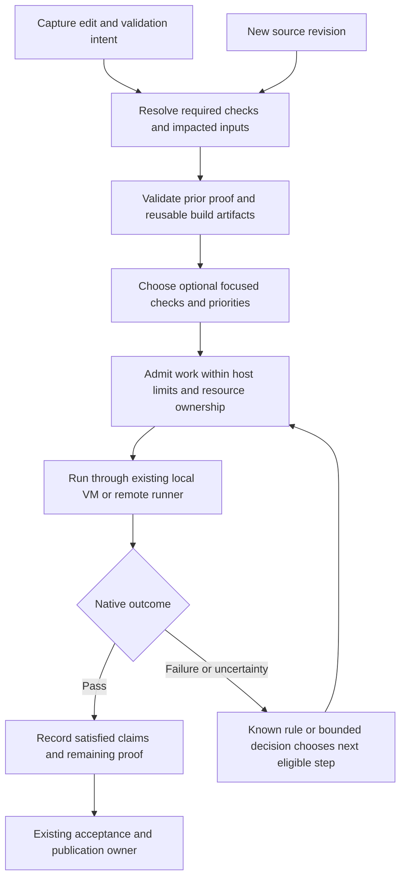

# Decision layer for local and remote CI

## Purpose and relationship to existing work

Make developer-local CI reduce both waiting and repeated computation. Moving the same oversized
check list onto a laptop is not the intended outcome. Select appropriate work, reuse applicable
evidence, find useful failures early, and preserve the developer's ability to keep working.

This is the detailed DL07 consumer proposal under the [decision layer](engine-decision-layer.md).
The [local-CI and merge contract](engine-local-ci-and-merge-contract.md) continues to own execution
trust, environment qualification, result publication and protected merging. Both local and remote
CI remain supported. Existing authorization for local CI does not need to be established again.

The [RC4 slice](engine-decision-rc4.md#ci-recommendations-with-meaningful-context) improves the existing
DL07 advice with declared scenario meaning and requirement evidence. It adds explicit opt-in v2
questions while keeping the actual required plan, order, reuse and execution unchanged. Reuse
existing pack descriptions and already-required run results before adding metadata or evaluation
work; begin with expensive optional scenarios. The wider
planner, predictive omission and placement proposals below remain later implementation scope.

The opportunity includes ordinary code improvements and JEV judgments. Their benefits must be
measured separately. JEV is useful where interpreting changed behavior helps choose among known
checks; it is unnecessary for calculating hashes, memory capacity or exact dependency impact.

## Decisions across the CI cycle

| Decision | Code supplies or decides | Proposed JEV contribution | Observable benefit |
| --- | --- | --- | --- |
| Which checks apply? | Current stage, policy, changed inputs and declared dependency closure | Flag likely behavioral impact missing from that map | Fewer irrelevant checks; fewer missed boundaries |
| Which focused scenarios help this iteration? | Eligible scenario catalog, required minimum and execution budget | Assess each optional scenario's relevance | Less broad LLM-directed testing |
| Which previous results remain usable? | Complete claim/input/tool/policy/producer applicability | None for validity; advice may request an extra scenario | Less repeated proof |
| Which builds are necessary? | Build graph, artifact identity and reuse conditions | Flag uncertainty about a changed behavior needing integration coverage | Fewer unnecessary rebuilds |
| What runs first? | Dependencies, measured duration, failure history and fairness | Supply a calibrated semantic relevance feature | Earlier useful feedback |
| How much runs concurrently? | Available memory/CPU, parent-host load and resource leases | None in the initial consumer | Less contention and wasted work |
| Where does a check run? | Qualified host/VM/remote capabilities, trust, queue and configured cost limits | Advice about a relevant scenario class, never invented capacity | Shorter valid execution path |
| When do we widen validation? | Explicit escalation rules, new inputs and failed/unknown required proof | Flag a missing behavioral category or ambiguous failure needing a known probe | Focused checks first, broader proof when justified |
| Is another attempt useful? | Retry budget, native failure type and observed condition changes | Classify an otherwise unresolved symptom; reuse DL05 diagnostics where applicable | Fewer blind retries and cache wipes |
| What becomes obsolete after another edit? | Candidate generation, input closure and job ownership | None | Fewer stale builds; no publication for an old candidate |
| Does this need a developer or LLM? | Exact blocked state, known runbook exhaustion and allowed choices | Match an unresolved case to a reviewed runbook or compact handoff | Fewer coordination turns |
| What should improve next? | Native cost/time/outcome aggregates and valid comparisons | Classify recurring expensive episodes through DL12 | Better future check maps and procedures |

Candidate selection and evidence reuse are different. An unchanged build artifact may save compilation
without satisfying a test claim. A successful test may be reusable only when its complete relevant
inputs and required execution conditions remain applicable under the owning policy.

## Prerequisites that must be delivered explicitly

The inspected core has impacted pack selection and run-level timing. Native command receipts also
retain process timing, but a stable per-check history projection and history-aware planner are still
needed. Pack `path_globs` select work; they do not declare all inputs needed to reuse a result.
Resource leases establish exclusivity, not a complete memory/capacity scheduler. Do not count these
proposed capabilities as already supplied by the core; recheck its evolving owners before implementation.

Extend existing records and owners with:

- **Per-check history:** stable pack/command/scenario identity and definition digest, source/target,
  attempt, native status/termination, duration, queue/setup/cleanup where known and capture time.
  Project existing receipt timing before adding new instrumentation. Show sample counts, p50/p95,
  last-failure age and unknown history; derive new/changed/recently-failed flags in code. Such flags
  inform reviewed selection rules; they are not universal mandatory-select rules copied from a vendor.
- **Declared inputs for reuse:** an optional check/pack input contract using the existing recipe
  resolution machinery where possible. Resolve source/config/generated inputs, dependencies, command
  and checker versions, relevant environment/toolchain, policy and producer/target requirements.
  The reuse key binds those facts and the claim; admission also checks expiry, trust, accessible
  evidence and current validity. Missing/incomplete declarations mean unknown closure and no proof
  reuse. Selection globs and observed coverage alone never establish a complete closure.
- **Observed coverage:** per-test executed-source edges where the runner supports collection,
  supplementing declared dependencies. Retain freshness, instrumentation scope and missing edges.
  Unmapped changes use the conservative existing path. An unexecuted branch is not proven irrelevant.
- **Host capacity:** configured workload classes and actual capability facts for build slots, VM
  slots, devices, simulator instances and memory reservation/headroom. Admission chooses capacity;
  the existing registry owns the corresponding leases. Slot counts are host-specific validated
  configuration, not a universal two-VM assumption. Unknown capacity takes a declared serial/bounded
  profile or remains pending, never a guessed concurrent launch.

These are independent vertical improvements. No full coverage database, long history collection or
new daemon is needed before an initial conservative local plan or the read-only JEV consumers.

## Validation intent and check classes

Each request names its intent: iteration feedback, review, merge, or release. Reuse the host's existing
stage vocabulary rather than creating a second stage system. A short iteration run cannot silently
become a complete merge or release result.

Every catalog check has one of three planning treatments for the current intent:

- **Always required:** policy requires it for this stage/candidate. Semantic advice cannot remove it.
- **Required when applicable:** the owning code/declaration determines applicability from changed
  inputs, dependencies, platform and policy. Unknown impact invokes the declared conservative route.
- **Optional focused coverage:** useful additional checks from the registered catalog. A qualified
  decision may select these within an explicit time/compute budget and existing operation authority.

This enables real selection immediately. We need not run all checks on every edit, nor ask the LLM
to choose them repeatedly. The non-JEV planner narrows the required set under existing rules; JEV
adds or prioritizes useful optional coverage. It cannot reclassify an applicable required check.

High-risk boundaries such as signing, package installation or schema migration keep their declared
validation floors. Model-identified risk may raise attention or trigger an eligible escalation rule;
a low score cannot waive one of those floors. If a floor cannot run locally, choose configured qualified
capacity or report it pending. Resource pressure is not permission to shrink required coverage.

## Plan contract

Extend the existing proof/workflow plan, not a second queue or scheduler. Proposed additions are:

| Field or record | Meaning |
| --- | --- |
| Intent and candidate identity | Existing stage, source snapshot/integration candidate, plan revision and policy identity |
| Impact coverage | Changed paths/symbols/packages, known dependency edges, unresolved boundaries and extractor versions |
| Check requirement | Required/conditional/optional treatment, applicability result and its deterministic rule reference |
| Check disposition | Run now, queue for this intent, reuse qualified evidence, inapplicable, or optional not selected |
| Evidence reference | Receipt/artifact identity and the code-produced applicability result; no inferred pass |
| Decision reference | Versioned question, bounded input identity, interpreted answer and fallback used |
| Work constraints | Dependencies, target/environment requirements, resource class and fixed registered operation ID |
| Delivery budget | Configured developer load limits and optional-work allowance, with measured estimates separately labeled |
| History/coverage identity | Stable check definitions, observations available at planning time, map scope and unknown history |
| Outcome | Native result, pending/blocked/superseded state, cleanup and remaining proof; preserve original failures |

For every check omitted from execution, record whether it was inapplicable, already satisfied by
valid evidence, or optional and not selected. These must not collapse into a generic green “skipped.”
Dependency-failed or cancelled work is not a pass. The existing acceptance owner determines whether
the requested claim has complete proof, independently of a model's plan preference.

An explanation uses rule/evidence references and concise templates: “reused this input-bound result,”
“selected because this scenario exercises changed behavior,” or “pending: no compatible capacity.”
Generating a paragraph with an LLM for each check would recreate the coordination cost.

Semantic changes to this plan use the explicit `shape-plan` capability. It may reorder, select optional
checks, or defer within a budget while preserving completion obligations and fairness. It does not
grant execution rights. Speculative work additionally requires the opt-in allowance below and existing
permission for the selected registered operation. A required check deferred today remains required.

## Proposed semantic questions

- `validation.scenario-relevance/1`: independent Boolean for each supplied optional scenario against
  the changed behavior and stated validation intent. Several scenarios may be relevant or none may be.
- `validation.coverage-gap/1`: independent Boolean over a supplied behavior/boundary category and
  the captured check map. Absence from a partial map remains uncertainty, not a proven missing test.
- `validation.escalation-match/1`: Choice among eligible declared next validation/probe steps plus
  unknown, after current evidence is available. An exact policy-triggered step bypasses this question.

Inputs include the bounded diff, requirement/bug behavior, relevant source excerpts, affected package
map, candidate scenario descriptions, existing proof applicability, native outcomes and known gaps.
Avoid sending entire CI logs or every test body. Retrieve the specific unresolved evidence once;
if it cannot fit without losing essential context, use the baseline or explicit expansion.

These questions describe relevance or matching, not predicted probability of a passing build.
Combine them with measured duration/history in a deterministic ordering policy. Record the separate
features so evaluation can establish whether JEV adds value over a plain dependency/history planner.

## A local iteration

For example, an app UI change may first need a targeted assertion and an RN scenario. Code decides
whether native inputs changed and whether a previous build remains applicable. A semantic question
can identify that the change also affects an error-state scenario. The executor runs the registered
checks, and a confirmed failure may trigger one known diagnostic. Merge still requires the full
applicable merge proof, which may reuse valid results from this iteration.

A change to native dependencies follows a different code-produced build path. JEV cannot declare
that rebuilding is unnecessary because the visible diff looks small. Likewise a text-only appearance
does not prove runtime irrelevance when the project treats templates or documentation as build inputs.

## Developer-machine behavior

Use existing execution profiles plus explicit optional-work and host-load limits. Admit a job only
when its actual resource requirements fit; prevent two heavy native builds from competing for the
same constrained memory or device. A VM consumes parent-host resources as well as guest resources.
The planner can prefer an applicable warm workspace/cache without weakening isolation or input checks.

Recompute admission from fresh facts. If the developer starts an interactive build or the host loses
capacity, defer work that has not started. Pause/resume only when the owning runner supports it;
do not suspend arbitrary process trees or reset unrelated services. Required work stays pending.

On a new edit, supersede only jobs whose claims depend on changed inputs. Preserve independently
applicable results and observe/cancel superseded jobs through their owner. Avoid repeatedly restarting
long-running work during active editing; use an explicit coalescing policy and an operator-requested
run boundary. An old candidate's late success cannot satisfy the new candidate automatically.

An infrastructure failure may use an already permitted local/remote fallback. A failing assertion
does not justify moving between machines to seek a pass. Retries require the owning policy and
retain the original failure; model-diagnosed flakiness cannot quarantine or hide a test by itself.
Sleep, lost connectivity and unknown cleanup follow the local-CI owner's recovery path. A publishing
outage retries publication after reconciliation, not already completed tests.

## Failure grouping and the next useful observation

Normalize known failure signatures in code and retain each original failure and target. Use
`failure.same-symptom/1` on residual pairs to group investigation context, not to merge proof results,
declare a shared cause or quarantine a historically flaky test. A familiar flaky test can reveal a
new regression. Qualify matching on the host's workload before any existing retry rule consumes it.

For ambiguous failures, research which permitted observation would best distinguish the remaining
explanations at the least measured cost. Start with a reviewed probe order and duration/resource
facts. JEV can assess which supplied symptoms a probe addresses; code compares costs and applies
budgets. Later outcome history can support a learned utility estimate. Native confidence is not
information gain or a measured probability that an intervention will help. Unknown utility uses the
runbook; a cheap discriminating read may be more useful than another expensive full build.

## Optional experiment: work ahead during spare capacity

An opt-in speculative allowance can run an already permitted likely-needed build or focused check
before the main path requests its result. Code handles known native-input changes, input identity,
setup costs and admission first; add semantic features only if they improve that baseline. Work
receives lower priority than required or interactive operations and stays within a declared resource,
time and attempt allowance. Availability of spare capacity alone does not authorize a command.

Use isolated outputs and normal ownership/cleanup. Warm a cache or produce an artifact only through
an approved operation; no releases, remote publication or unrelated device resets. New edits invalidate
only affected outputs. The owner may cancel safely or retain an applicable result; a speculative result
must pass normal applicability checks before the plan uses it. Report hit rate, wasted build minutes,
developer contention and net completion time. Speculation may increase compute while reducing waiting;
disable it when that tradeoff does not meet the selected profile's objective.

## Three levels of check reduction

1. **Deliver first:** existing applicability rules, exact proof/artifact reuse, focused optional
   scenario selection, duplicate/superseded work suppression and early feedback ordering. All work
   required for the requested claim remains accounted for. This can reduce actual compute now.
2. **Improve through evidence:** use semantic gap findings and execution history to propose better
   declared dependency/check maps. A reviewed map change updates the deterministic planner. Learned
   relevance edges remain labeled inferences until validated and deliberately accepted.
3. **Evaluate later, explicitly:** predictive omission of otherwise applicable checks may offer more
   savings. Preserve it as a proposed experiment, not a forbidden direction or an implied launch feature.
   Activation requires a separately accepted policy identifying omittable checks, protected coverage
   floors, applicable workloads, missed-regression budget and requalification/rollback conditions.

For that third level, use a held-out full-result corpus and bounded independent audit samples of
omitted checks. Measure regressions detected only by omitted tests, selection coverage, drift, and
net compute including audits and rework. Include new tests, unknown dependency edges and unusual
changes. Full-validation triggers and audit frequency belong to the accepted experiment policy;
do not permanently duplicate every local run remotely as reassurance.

## Fallback and measurement

Missing token or provider outage immediately uses ordinary impacted selection, valid reuse and
dependency/duration/history ordering. The developer still receives a useful local plan. Ambiguous
semantic impact invokes the declared conservative scope or one compact handoff; it cannot imply
that an unknown area is unaffected. No provider is required for admission, execution or publication.

Record planned versus actual work per candidate/intent: applicability reasons, reuse accepted/rejected
and why, selected optional checks, decision/ordering features, superseded work, dependencies, capacity
wait, build/test/cleanup duration, failures, missing proof and eventual accepted completion. Attribute
shared build steps once. Do not add overlapping wall times or infer savings from fewer selected names.

Compare three levels on equivalent cases: current workflow, improved deterministic planner, and that
planner plus JEV. Freeze scenario pools, policies and workload splits for the comparison. Report:

- Time to useful feedback and time to accepted merge, separately.
- Build/test compute, avoidable reruns and native all-model tokens.
- Host contention, queued time and developer interruptions; warm/cold runs separately.
- Missed relevant scenarios, false gap alarms, escalations and rework.
- Required-proof completeness and any escaped regression, with incident-separated analysis.

Replay establishes selection quality and potential ordering; it does not prove real host-load or
elapsed-time gains. Use a bounded live comparison for those claims. Coverage of every platform,
every machine and every VM is not a prerequisite for a useful first qualified local lane.

Record offered alternatives, actual chosen action, decision-time features and later outcomes. If a
future experimental policy randomizes selection, retain its actual assignment probability, not JEV
confidence relabeled as one. Selected-only observations are biased evidence about unrun checks;
use full-result history or bounded independent audits before making counterfactual savings claims.

## Acceptance and delivery

- LCI1: required/conditional/optional checks and every non-execution reason remain distinguishable;
  no semantic result changes a required check into a pass or an inapplicable check.
- LCI2: stale proof, changed base/candidate, toolchain changes and unknown input closure invalidate
  reuse as the owning contract requires; cache hits alone never establish a passed check.
- LCI3: targeted selection catches held-out cross-package and new-scenario cases; missing graph
  coverage takes the baseline/expansion path, including when the provider is absent.
- LCI4: scarce RAM/CPU, a busy device, parent-VM contention and unavailable qualified capacity defer
  or route work correctly without dropping required proof or starving older eligible work.
- LCI5: edits during a build, late results, duplicate notices, sleeping hosts and uncertain cleanup
  do not produce duplicate execution, leaked ownership or a stale green merge result.
- LCI6: local and remote execution preserve identical question semantics and the same applicable
  claim, while target-specific facts and producer trust remain explicit.
- LCI7: report incremental benefit over the improved deterministic baseline, including JEV overhead,
  audits where used, developer disruption and rework; do not attribute all CI savings to JEV.
- LCI8: predictive omission remains disabled until its separate policy and evidence are accepted;
  disabling it restores the ordinary applicable check set without disabling useful local CI.
- LCI9: per-check history exposes sample/coverage limits; observed edges never imply complete closure;
  cold-start and unmapped cases retain conservative selection.
- LCI10: a new regression in a historically flaky test remains visible after grouping; speculative
  work cannot starve required work, exceed its allowance or reuse stale results.

Research foundations include [Meta's deployed selection system](https://engineering.fb.com/2018/11/21/developer-tools/predictive-test-selection/),
[Google's comparison of selection heuristics](https://research.google/pubs/assessing-transition-based-test-selection-algorithms-at-google/),
and [Nx's declared-input caching](https://nx.dev/docs/concepts/how-caching-works). They motivate strong
code/history baselines and explicit input contracts; they do not establish JEV benefit for this engine.

The [technical work-package reference](../reference/2026-09-20-decision-layer-work-packages.md#p5--local-ci-planning-selection-and-feedback-dl07)
separates planning/reuse, semantic selection/escalation and optional omission research. Delivery is
owned by the [S0–S10 plan](../exec-plans/active/2026-09-21-major-adoption-and-measurement.md): S2 ships
check advice using available catalogs/history; S6 delivers deeper planning/reuse and execution effects.
Device recovery qualification is not a prerequisite for useful local-CI work.
