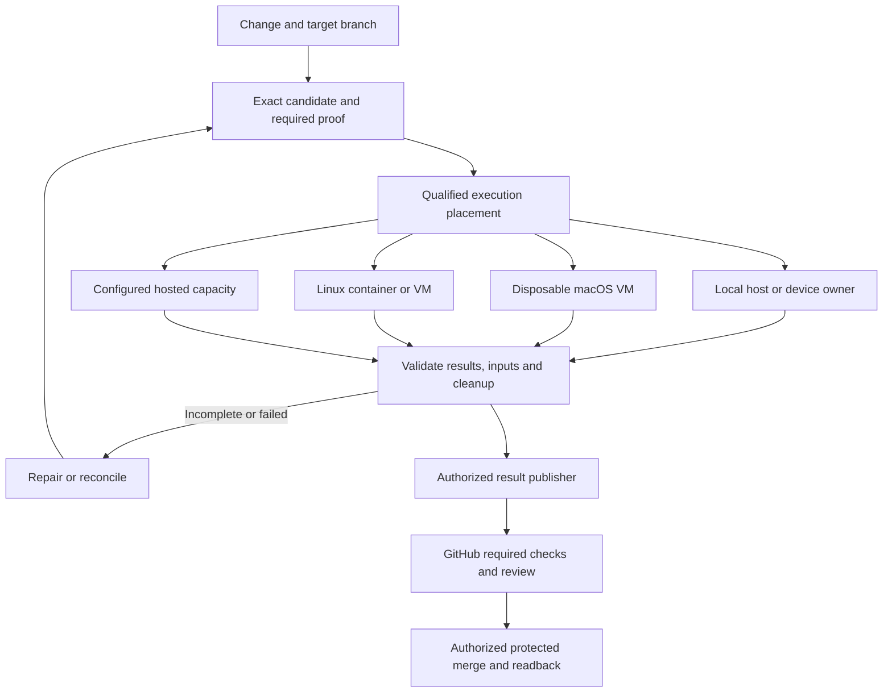

# Local CI and merge evidence

Both traditional remote CI and developer-local CI are supported product requirements. The operator
reports that GitHub already authorizes local CI. Preserve and integrate that established path rather
than treating authorization as an unresolved prerequisite or requiring a new publisher by default.
This document specifies the future engine's integration contract, not the current remote configuration.
Qualified local execution may satisfy the applicable required checks without hosted repetition.
Independent verification of candidate, policy and results does not require a GitHub-owned machine.

This contract extends the [workflow contract](engine-workflow-and-device-contract.md). Use its existing
run, artifact, evidence and resource records; do not add a second scheduler or parallel receipt system.
JEV and Mnemos are not required for planning, execution, result validation, publication or merging.

## Separate three responsibilities

1. **Proof planning:** determine required claims and fixed project-owned commands from exact inputs
   and policy. Availability of a fast machine must not reduce required coverage.
2. **Execution placement:** choose a qualified environment with capacity for those commands. One
   existing runner owns each process or device; the engine delegates to it rather than supervising twice.
3. **Merge integration:** validate complete evidence, publish the required result and reconcile the
   protected merge. A worker finishing successfully does not authorize publication or a merge.

The placement branches are alternatives for compatible claims, not interchangeable platform proof.
An iOS simulator is a test target; macOS is its execution environment. A macOS VM containing Xcode
is not an iOS VM. A physical handset is a separately owned target, with explicit transport support.

## Environment and target contract

Record the applicable facts, not just a label such as `local` or `macOS`:

| Dimension | Required meaning |
| --- | --- |
| Subject and command | Candidate/tree, dependency/input closure, trusted recipe/check and policy versions |
| Execution environment | Native host, container or VM; OS/build, CPU architecture and emulation where used |
| Toolchain and image | Actual tools/SDK/runtime versions and immutable image identity where applicable |
| Capacity | CPU, memory, workspace limits and relevant parent-host/VM constraints |
| Test target | Simulator runtime/identity, physical device/OS/transport, browser or other declared target |
| State and isolation | Fresh workspace, cache provenance, trust class, filesystem/network exposure and credential scope |
| Ownership | Host/guest/slot, attempt/generation, resource leases, output location and cleanup disposition |

Capabilities are independently qualified. A successful Swift package test inside a macOS VM does
not establish RN simulator readiness, graphics, browser support, signing, USB passthrough or wireless
device access. Nor does Linux arm64 prove Linux x86 packaging or timing. Detect unavailable capabilities
before dispatch; retain the original claim when choosing another compatible provider.

Keep a **throughput profile** that uses approved local capacity and a separate **constrained profile**
for resource-sensitive claims. A faster CPU or larger memory allocation may be valid for ordinary
correctness proof when policy allows it; it cannot certify a smaller resource budget. Measure cold and
warm behavior separately. Container limits must fit the parent VM and concurrent host workload.

For the initial RN workflow, qualify the simulator on the native Mac first and the physical device
through its host owner next. VM simulator support is a separate environment extension, not a new
prerequisite. A later guest-build/host-device split must verify the transferred binary and bundle,
retain one device owner and qualify the complete path. Do not assume guest device passthrough.

## Development evidence versus merge-eligible execution

Fast development runs may use a bound dirty workspace and long-lived owned Metro session. They remain
useful evidence. Merge-eligible runs additionally require a reproducible immutable candidate, known
policy/check inputs, the required environment/trust class, complete assertions and accessible artifacts.
An arbitrary local green log, mutable bind mount or self-described JSON receipt is insufficient.

Use the same project command catalog in local and hosted execution. Avoid translating workflow YAML
into a second independently maintained build system. Dependency/build caches are performance inputs,
not passing verdicts. Keep writable build outputs isolated across concurrent worktrees; share caches
only under a declared safe ownership/provenance contract. A warm disposable guest need not inherit a
previous job's mutable workspace or secrets.

Accept existing completed results only after their owner certifies the full claim/input/environment
and trust binding. Selection omissions, absent assertions, parser errors, contradictory or duplicate
results and unknown outcomes cannot become success. Preserve test counts and native result semantics;
process exit alone is not always sufficient. Revalidate applicability when a base, policy or input changes.

The publisher must use trusted policy and validator code outside candidate control. Build/test code
must not receive the credential that can publish the trusted aggregate or merge the branch. An App
signature authenticates a producer; it does not prove that an arbitrary laptop executed honest tests.
The adopter must choose the host trust model. An approved maintainer-operated host can be eligible
under that model; stronger independence requires a separately administered executor. A VM isolates
candidate code from the host but cannot establish independence from a malicious host administrator.

This separation applies to ordinary maintainer builds too, including dependency scripts. The pilot
must name an enforceable boundary: for example, an isolated candidate guest with no host home,
keychain/agent socket or credential mounts, and a publisher outside it; or separate OS principals with
qualified access controls. A separate process or a filtered environment alone does not isolate a
credential readable by the same user. The publisher accepts bound evidence through trusted validation,
not an arbitrary request to mark a SHA green. Consume the already authorized integration's mechanism
where it meets this contract; no new App is required. E1a uses negative fixtures; the actual pilot
tests credential reachability with a canary and attempts forged/replayed publication through the
candidate boundary. Host-administrator trust remains a separate, explicit limitation.

Of the general isolation options above, the first CI pilot chooses a Linux container/guest and a
self-contained macOS VM; separate-principal bare-host execution is a later qualification option. Its candidate
processes may not directly control the host's Metro/service ports, simulators, physical devices or
shared writable build outputs. The host controller owns container/VM capacity through its own resource
authority; guest-local resources stay with the guest owner. This keeps a separate executor account or
guest from bypassing the same-account host registry. The initial native-host RN lanes remain distinct
development evidence. A later merge-eligible host-device lane must qualify delegation through the
existing host owner: the isolated executor cannot independently acquire, release or mutate that
resource, and all operations/results retain the owner's generation/target binding. If a selected
claim needs such a resource before that path qualifies, use an already qualified provider or report
that claim blocked; never silently downgrade the claim or weaken isolation.

Untrusted changes need a separately qualified isolation/credential policy. Do not run them with host
checkout writes, host credentials, signing keys, a container-engine socket or broad private-network
access. Restrict package credentials to the approved scope. Signing/release publication and attended
physical claims retain their own authority and are not implied by CI eligibility.

## GitHub integration and candidate freshness

Retain traditional remote CI as a first-class path. Local execution can integrate through either
mechanism below; inspect and reuse the already authorized mechanism before choosing adapter work:

| Path | Benefit and cost | Proposed use |
| --- | --- | --- |
| GitHub Actions with ephemeral self-hosted workers | Retains existing workflow/check plumbing; still depends on Actions dispatch and any hosted control jobs | Supported local execution integration when selected by the project |
| Engine execution plus a trusted GitHub App publisher | Supports local execution without an Actions runner; owns result delivery, trust and recovery | Supported direct integration; reuse the authorized publisher where present |

Keep protected PR review and merge rules. Do not replace them with an unrestricted direct push or
administrative bypass. Check publication and merge execution are distinct authorized operations.
Use a specific trusted App as the expected check source where supported. Do not report two competing
required aggregates for the same responsibility during cutover. Offline/no-credential development
still works; publication remains pending and cannot make the remote gate green.

Recommended initial engine scope is result publication plus observation of merges initiated by the
operator or existing platform automation. N13 settles whether to add engine-initiated merge before
the pilot scope freezes. Existing authorized host/platform merge paths remain available. Candidate
freshness and destination readback below apply in either case; request submission, queue management
and ambiguous merge-request recovery belong to the merge executor if that capability is selected.

Bind repository, target branch, PR head, base, selected integration candidate/tree, proof plan and
policy. For a merge queue, execute and report against its supplied candidate SHA; a successful PR-head
check is not automatically a successful queue check. Handle replaced candidates and cancel superseded
work where safe. Reuse only independently applicable claims; never copy the old overall verdict.

Prefer the hosting platform's merge queue when available. If unavailable, qualify a protected,
up-to-date-branch workflow with server-enforced freshness and explicit merge-method semantics. A
client-side reread or local mutex cannot prevent a concurrent base update. A merge API head-SHA
precondition alone is not a base-SHA precondition. Do not claim an atomic custom merge protocol before
proving its server-side enforcement. Tree equivalence under squash/rebase is usable only where the
claim does not depend on commit metadata and policy explicitly admits it.

After a timeout publishing a result or requesting a merge, reconcile the remote identity/outcome
before retrying. Publication retries do not rerun completed tests. Read back required checks, merge
result and destination identity. Retain separately required post-merge/release checks rather than
silently treating pre-merge evidence as release authority.
Local-CI authorization does not change deployment authorization. The optional release boundary in
[capability extensions](engine-capability-boundaries.md) can consume proof from either CI path.

## Availability, recovery and measurement

Use bounded readiness leases and start deadlines. Unsupported, disabled, busy, sleeping or offline
hosts route to configured compatible capacity or report a bounded blocked state. There is no promise
of hosted capacity without its configuration, permission and cost policy. The pilot recommendation is
at most one hosted fallback for a classified infrastructure failure, within a declared budget.
An ordinary failing assertion remains a failure; do not rerun it elsewhere to seek green.

Before replacement execution, reconcile/cancel the old owner and fence its late outputs. Unconfirmed
device or mutable-resource cleanup prevents reassignment of that resource. Preserve results when only
publication fails. Quarantine a slot whose disposal fails; do not let a historical readiness lease
re-enable it. Host sleep/restart, guest loss and cancellation need explicit recovery cases.

Extend existing telemetry with candidate/queue identity, provider/profile, wait/provision/build/test/
transfer/cleanup/publication time, cache state, fallback and supersession reasons, host contention,
actual billed cost where available and attributable operator time. Unknown cost stays unknown. Compare
time to accepted merge and total repeated work, not just command duration or hosted runner minutes.

## Qualification and rollout

E1 defines capability, trust, candidate and publication seams with fixtures. A bounded pilot alongside
E2–E5 qualifies one existing Linux command and one narrow macOS VM command before expanding coverage;
it does not delay RN simulator-to-physical progression. Keep project adapters in their owner until
shared behavior is established. Ship optional adapter support in the single product contract, with
explicit environment provisioning; core install must not silently fetch VM images or require Docker.

Before remote activation, prove stale head/base and queue replacement, absent/offline/busy capacity,
wrong image/architecture/toolchain, missing/duplicate/forged evidence, genuine assertion failure,
executor inability to reach publisher credentials or bypass trusted validation, lost worker,
incomplete cleanup and publisher outage. The actual merge owner proves ambiguous merge-response
recovery; an observation-only engine records uncertainty and does not resubmit it. Compare the same
claim under qualified local/hosted profiles. For an already authorized local-CI path, prove that the
engine preserves its source/producer/check binding and readback; no new authorization ceremony is
implied. Only when adding or changing that remote integration, use a non-required pilot and deliberately
switch the selected required check under the applicable authority.
Do not permanently double-execute all checks for reassurance.

N8–N10 in the [migration inventory](../reference/2026-09-20-engine-migration-inventory.md#next-operator-decisions)
record the settled dual-CI direction and remaining integration, trust/coverage and fallback choices.
No runner registration, GitHub setting,
status publication, merge, VM provisioning or adopter edit is authorized by this planning document.

## External contract references

Checked 2026-09-20. These describe platform capabilities, not an adopter's enabled configuration:

- [GitHub self-hosted runners](https://docs.github.com/en/actions/reference/runners/self-hosted-runners):
  unmatched jobs can queue for 24 hours; ephemeral runner lifecycle still needs cleanup and retained logs.
- [GitHub required checks](https://docs.github.com/en/repositories/configuring-branches-and-merges-in-your-repository/managing-protected-branches/about-protected-branches)
  and [Checks API](https://docs.github.com/en/rest/guides/using-the-rest-api-to-interact-with-checks):
  external results and an expected App source can preserve the protected merge boundary.
- [GitHub merge queues](https://docs.github.com/en/repositories/configuring-branches-and-merges-in-your-repository/configuring-pull-request-merges/managing-a-merge-queue):
  queue candidates have their own SHA; Actions uses `merge_group`, external CI must handle queue branches.
  Availability depends on repository/account plan and must be checked before adoption.
- [GitHub merge API](https://docs.github.com/en/rest/pulls/pulls#merge-a-pull-request):
  its `sha` parameter guards PR head identity, not an independently supplied base identity.
- [Tart](https://tart.run/) supports macOS/Linux guests on Apple Silicon; its
  [FAQ](https://tart.run/faq/) documents version-dependent virtualization and networking limits.
- [Apple simulated and physical destinations](https://developer.apple.com/documentation/xcode/running-your-app-on-simulated-or-physical-devices)
  remain distinct target types; platform documentation does not qualify an adopter's VM/device path.

## Implemented first-slice seam

`components/engine/src/integration-candidate.ts` validates exact repository/branch/head/base/integration
identity and proof-plan/policy digests against controller-observed values. It admits a declared qualified
execution profile, rejects candidate access to publisher credentials, and validates producer-bound
claims through an independently supplied verifier. Lost worker or publication replies retain the same
request digest for observation; a published result requires matching readback identity.

Six fixtures cover stale candidates, missing capacity, worker loss, untrusted evidence, credential
reachability and publication recovery. These are pure contract checks, not an isolation mechanism,
credential broker, capacity scheduler or live publisher. Existing resource owners retain execution;
live producer trust and isolation require separate selected-provider qualification.
