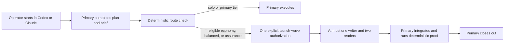

# Provider-Aware Agent Orchestration Specification

## Purpose

Define a small, explicit way for work started in Codex or Claude Code to use cheaper models from
that same host. The running host identifies the primary agent. The primary owns framing,
architecture, planning, integration, proof, and operator communication. A specialist receives one
complete bounded brief only when delegation is cheaper or provides named independent assurance.

This specification defines policy and contracts. It does not add provider clients to the runtime
kernel. Native host adapters launch their own models.

## Evidence Behind The Default

- A controlled study found gains on parallelizable work but a 39–70% decline on sequential
  reasoning, with centralized coordination containing errors better than independent swarms. See
  [Google Research](https://research.google/blog/towards-a-science-of-scaling-agent-systems-when-and-why-agent-systems-work/)
  and the [underlying paper](https://arxiv.org/abs/2512.08296).
- Anthropic reports that its multi-agent research system uses about 15 times as many tokens as a
  chat interaction and notes that coding has fewer naturally parallel tasks. See
  [Anthropic's multi-agent research system](https://www.anthropic.com/engineering/multi-agent-research-system).
- A budget-controlled study found that a capable single agent matched or outperformed multi-agent
  variants on multi-hop reasoning under equal thinking budgets. See
  [the equal-budget study](https://arxiv.org/abs/2604.02460).
- OpenAI recommends multi-agent execution when work separates cleanly and reports meaningful token
  reductions from leaner coding-agent prompts. See
  [OpenAI model guidance](https://developers.openai.com/api/docs/guides/latest-model).

These findings support compact context, deterministic routing, one integration owner, and only
genuinely independent specialists.

## Version 1 Boundary

Version 1 runs only inside Codex or Claude Code:

| Host | Primary | Eligible specialists |
| --- | --- | --- |
| Codex | Current Codex session model | Codex profiles supplied by that session's adapter |
| Claude Code | Current Claude session model | Claude profiles supplied by that session's adapter |

The provider is implied by where the operator started the task. Version 1 has no local-model,
standalone, cross-provider, parallel-writer, nested-delegation, or specialist-retry path. Missing
host identity or catalog data returns solo without machine scanning or provider discovery.

## Core Rules

1. **The primary remains accountable.** It owns decisions, integration, proof, and the operator
   conversation.
2. **Solo is the zero-overhead fallback.** A router never delegates merely because work is large.
3. **The plan chooses the capability tier once.** The router maps it to the current host; it does
   not reinterpret task difficulty.
4. **One deterministic decision precedes delegation.** No agent decides whether to spawn an agent.
5. **One delegated writer is the repository limit.** At most two independent read-only specialists
   may share the same launch wave.
6. **One explicit operator action authorizes one launch wave.** Post-integration QA is a separate
   assurance task only when the operator chooses it; it is not an automatic approval loop.
7. **A specialist never re-plans or retries.** A missing decision terminates that entry and the
   primary completes the remainder solo.
8. **Critical safety failures suspend.** Ordinary cost, timeout, proof, or quality misses do not
   create automatic review state or subjective equivalence analysis.
9. **Telemetry writes once.** One terminal task receipt is advisory; control state owns replay and
   critical suspension.
10. **Builds remain deterministic.** The harness runs the build subprocess; the primary interprets
    bounded results. Version 1 enables no build agent.
11. **Native tools do not bypass governance.** A host launches only entries returned by
    `agent-dispatch start` and closes them through `agent-dispatch finish`. Direct native spawning
    is outside governed delegation and must be reported as such rather than silently treated as an
    equivalent path.

## Specialist Roles

| Role | Responsibility | Prohibited behavior |
| --- | --- | --- |
| Implementation worker | Change one declared component within one write scope | Re-plan, integrate, retry, or edit outside scope |
| Research scout | Answer one named question from bounded sources | Open-ended repository exploration |
| QA reviewer | Review one immutable snapshot against named claims | Edit the snapshot or silently repair findings |

The existing build-verifier role remains dormant for compatibility with current assets, but Version
1 performs no profile selection, fixtures, or adapter work for it. A deterministic command runner
produces the build result and the primary handles any diagnosis.

## Capability Selection And Model Chart

The primary records `required_capability_tier` when it marks a slice packet-ready. The classification
is fixed before routing:

| Tier | Use when | Codex profile | Claude profile |
| --- | --- | --- | --- |
| `economy` | One bounded component, fixed behavior, known write scope, deterministic proof, and no cross-component synthesis | Luna high | Haiku 4.5 medium |
| `balanced` | Fully decided work that still needs multi-component or multi-contract synthesis, migration reasoning, or substantial diagnosis | Terra high | Sonnet 5 high |
| `primary` | Unresolved architecture, behavior, ownership, high-risk integration, repair, or a task too small to justify delegation | Current session model; recommend Sol high when the operator starts the task | Current session model; recommend Opus 5 high when the operator starts the task |

Most well-specified bounded implementation should be `economy`. `balanced` is not the default; it
is for intrinsically synthesis-heavy but already-decided work. `primary` routes to solo and is also
used for planning and integration in every task, but should not consume most implementation tokens.

Scope alone does not make a slice economy work. Before selecting `economy`, the plan must mark the
semantic contract settled: behavior, wire tokens, failure states, platform boundaries, safety and
privacy rules, and proof obligations are fixed rather than being discovered through implementation.
If any of those decisions remain open, the primary completes one consolidated architecture pass
before writing begins. Already-decided multiplatform or multi-contract implementation is
`balanced`; isolated platform adapters or renderers may become `economy` only after their shared
contract is frozen. This rule applies especially to Kotlin Multiplatform foundations, where a small
write scope can still carry cross-platform API and serialization semantics.

This dated chart is the only documentation copy of concrete model names. Neutral code stores tiers,
roles, and adapter-supplied profile identifiers. The implementation plan references this chart
instead of repeating it. The operator chooses the primary in the Codex or Claude Code session
settings before the task begins. The runtime detects that actual session model; it does not set,
upgrade, or replace the primary.

## Repeated-Failure Consultation Ladder

This ladder governs an explicitly requested read-only second opinion after the primary has inspected
the owning check for a repeated failure. It is not delegated implementation, specialist retry, or
cross-provider routing under Version 1. The primary remains responsible for verifying and
reconciling the response.

1. Start with Claude Opus 5 at high effort.
2. Escalate to Claude Fable 5 at xhigh effort only when the Opus consultation fails, is unavailable,
   or remains materially inconclusive.

Stop after the first conclusive response. Max effort is not an automatic step. An adapter must not
silently substitute another model, broaden write permissions, or treat the consultation as approval.
The packaged `peer-dispatch.yaml` resource carries the same executable launch guidance for installed
review skills.

## Orchestration Flow



An independent QA pass against the integrated result is a new read-only assurance wave with its
own explicit start. It is optional, uses a stable snapshot, and never triggers itself.

## Plan Authoring Contract

The specification owns behavior and safety. The implementation plan owns delivery order,
component ownership, focused proof, and progress; it does not repeat this policy.

The canonical plan spine is outcome, fixed implementation decisions, topology/budget, ordered
slices, acceptance/rollback, and progress. A trivial edit may record a no-plan rationale. A solo
plan needs only `Execution: solo` and ordinary proof.

Each dispatchable slice uses:

```markdown
## Slice <id>: <outcome>

- Depends on:
- Ownership: <component, write scope, exclusions>
- Execution: sequential | parallel with <slice IDs>
- Required capability: economy | balanced | primary
- Fixed decisions:
- Acceptance:
- Focused proof:
- Escalate or stop when:
- Packet ready: yes | no
```

The primary owns the capability and readiness attestations. The router validates their presence,
dependency order, scopes, writer count, snapshot identity, and profile eligibility. It does not
infer conceptual independence or missing design decisions from prose.

## Existing Context Contract And Compact Worker Brief

The shipped Version 3 context packet and `project-governance context` command remain the authority
for selecting and materializing bounded context. Version 4 is an explicit migration, not a parallel
packet system:

- the existing host-side task envelope retains context packet IDs, references, digests, leases,
  provider IDs, budgets, and snapshot identity;
- the host adapter projects that envelope into a compact worker brief and injects only the selected
  materialized context items;
- delegated skills consume the brief rather than receiving the 28-field control envelope verbatim;
- `parallel-isolated` and the multiple-writer invariant are removed from Version 4;
- provider usage changes from `not-reported` to optional, because some native hosts may return it;
  absence remains normal; and
- the nonexistent optional target policy `docs/governance/delegated-execution.md` is removed as a
  required discovery path.

The worker-visible brief contains:

| Field | Purpose |
| --- | --- |
| `task_id`, `role`, `required_capability_tier` | Stable assignment and preselected tier |
| `objective` | One bounded outcome |
| `governing_refs` | Small selected authority set |
| `base_snapshot` | Immutable source identity |
| `read_scope`, `write_scope`, `exclusions` | Exact authority boundary |
| `fixed_decisions` | Decisions the worker may not reopen |
| `acceptance`, `focused_proof` | Required outcome and cheapest proof |
| `output_token_ceiling` | Entry-specific output bound |
| `escalate_or_stop_when` | One-way return conditions |

Turns, effort, input/context ceilings, and tool permissions come from the existing role/profile
contract. One `delegated_token_ceiling` bounds the entire launch wave. Control metadata and adapter
handles are never placed in model context.

The result contains task ID, status, outcome, changed artifact references, proof status, findings,
blockers, termination reason, and optional provider-reported usage. It contains no transcript. A
`needs_primary_decision` result terminates delegation for that entry; the primary completes solo
without re-dispatch or another authorization prompt.

## Deterministic Routing

The router checks, in order:

1. native session identity and same-provider catalog;
2. specialist obligation and `Packet ready: yes`;
3. the primary-selected capability tier;
4. role, permission, privacy, scope, and profile compatibility;
5. repository writer lease and the one-writer/two-reader cap;
6. critical suspension state; and
7. entry and launch-wave token ceilings.

The native catalog declares one ordinal `tier_rank` for every eligible profile, including the
current session model. Rank increases with capability: `economy` ranks below `balanced`, which
ranks below a frontier primary. An efficiency route is eligible only when the selected specialist
rank is strictly lower than the primary rank. Assurance is exempt from this comparison: it names
one read-only claim and one token ceiling because independence, not savings, is its benefit. There
are no prices, currency weights, estimated savings thresholds, retry models, or catalog staleness
calculations in Version 1.

At command entry, the router captures one `evaluation_instant`. The normalized route decision is
byte-stable for identical envelope, session, catalog, control state, and evaluation-instant inputs.
The surrounding route request emits that instant as `issued_at` and adds `start_expires_at`; those
volatile fields are not part of the normalized decision body.

## Dispatch Commands And Control State

The runtime adds three explicit interfaces:

```text
project-governance agent-route --task <envelope> --session <identity> --catalog <catalog> --json
project-governance agent-dispatch start --request <route-request> --json
project-governance agent-dispatch finish --authorization <digest> --results <result-bundle> --json
```

`agent-route` is read-only. `agent-dispatch start` is the operator-authorized write boundary: it
revalidates the request structure, current suspension state, repository-wide reader/writer caps,
snapshot and task identity, profile fields, brief schema, and token ceilings; acquires the repository
writer lease when needed; records the authorization; and returns the exact native launch entries
without launching a model. The host launches them. The request digest detects mutation and replay
within its validity window; it is not a signature or an authentication credential.
`agent-dispatch finish` records the terminal results, releases the writer lease, records any
critical suspension, and appends the one telemetry receipt.

Each of the three commands captures one evaluation instant at command entry and uses it for every
deadline comparison in that invocation. The clock is injectable for deterministic tests; only the
router's normalized decision has the byte-stability contract above.

The authorization contains only `base_snapshot`, launch entries, total delegated token ceiling,
request digest, start expiry, active lease deadline, and one `authorization_digest` over the whole
document. A consumed request cannot start again during its 30-minute validity window. An active
specialist wave has a maximum two-hour lease. At the
next `agent-dispatch start` or `finish`, an expired active lease becomes terminal `timed-out` and
releases the writer lease. A late `finish` for its own expired authorization rejects the submitted
result, records `timed-out` in control state, and appends no telemetry receipt. The read-only router
always treats an expired lease as nonblocking but never writes state. Because no timely `finish` was
accepted, that timeout remains control-state evidence and is not synthesized into telemetry.
Primary solo work after specialist failure is outside the delegated token ceiling and does not
require another authorization. A `finish` for an unknown or already-pruned authorization is an
invalid-authorization no-op: it changes no state and writes no telemetry.

The ignored `.governance/state/agent-control.json` stores active and terminal authorizations,
short-lived consumed-request digests, deadlines, the repository writer lease, and critical
suspensions. State is `active` or `terminal`; terminal reason is `completed`, `failed`, `cancelled`, `timed-out`,
`budget-exhausted`, or `needs-primary-decision`. A terminal authorization remains through the
dispatch write that made it terminal and is pruned only by the next successful `start`; it is never
created and pruned in the same transaction. Active leases and suspensions are never pruned while
effective. Writes use shared atomic/locking helpers. An unreadable or unlocked store disables
delegation but leaves solo work and validation available.

Version 1 control state written before replay protection may omit `consumed_requests` and may
contain authorizations without `request_digest`. The loader normalizes the missing collection to an
empty list and preserves those authorizations; every newly written authorization and consumed
request includes the request digest. No second state version or migration command is required.

Only scope, permission, privacy, credential, or result-integrity violations automatically suspend
a role/profile pair. An explicit critical violation suspends only the offending task's role/profile;
a wave-wide trusted-identity contradiction suspends each authorized role/profile because no result
can be attributed safely. Other failures are visible in telemetry and the next task simply
re-evaluates normally; Version 1 has no `review_due` state, durable review counter, or automated experiment.
An incomplete or malformed host result envelope fails the wave but is not itself a permanent
suspension. Duplicate, missing, unexpected, or contradictory trusted task identities and explicit
critical violations are result-integrity failures and do suspend.

## Concurrency And Stop Rules

- Default concurrency is the primary alone.
- One repository-level delegated writer lease protects the checkout across concurrent native-host
  sessions. It does not claim to police unrelated manual edits outside the harness.
- Across active waves, the repository contains at most one delegated writer and two read-only
  specialists. One launch wave is bounded by the same cap.
- Concurrent readers use immutable inputs, separate mutable tool state, and a primary-owned join.
- Parallel writers, nested delegation, provider cascades, and specialist retries are prohibited.
- One primary-owned repair and one deterministic recheck may follow QA. If that recheck fails, stop
  and return to the operator.
- The recheck closes the named QA finding and directly adjacent claim only. It does not authorize a
  fresh general QA pass, another verifier, or a repeated broad matrix.
- A passed proof repeats only after recorded invalidation.

## Low-Overhead Telemetry

`agent-dispatch finish` appends at most one `orchestration-terminal` record per delegated launch
wave to the existing bounded ignored ledger. A new allowlist sanitizer retains only entry role,
profile/model, enumerated terminal outcome, duration, optional reported input/output tokens,
enumerated proof result, and fallback/repair flags. It records no intermediate lifecycle events, prompts, responses, paths,
commands, tool counts, compactions, spend estimates, savings estimates, or subjective scores.

`project-governance telemetry status` remains fail open and reports, for dispatch waves that called
`finish` and whose orchestration records are currently retained:

- delegated entry count and terminal outcomes;
- each model's count and percentage of retained delegated entries; and
- reported input/output token totals when supplied by the host.

The output labels its retained record count, oldest/newest receipt time, and the fact that
control-state-only timeouts and evicted receipts are excluded. It is a **best-effort retained
delegated model mix**, not a complete outcome ledger, total project usage, or invoice accounting. A
malformed receipt is skipped, never fatal. The summary performs bounded arithmetic only: no model
call, network request, background task, or write.

The operator may review the first ten completed delegated tasks or the first 30 days of use using
whatever receipts remain in the bounded ledger. The review is explicitly best-effort; Version 1
does not schedule, enforce, or repeatedly prompt for it.

## Failure Behavior

- Missing host identity, catalog, readiness, or lower eligible tier: execute solo.
- Expired route request: rematerialize only if the operator still asks to delegate.
- Control-state or writer-lease failure: disable delegation and continue solo.
- Provider failure, budget exhaustion, or missing decision: terminate the entry and let the primary
  finish solo without another start prompt.
- A non-completed writer entry never triggers automatic rollback. Its in-scope working-tree edits
  remain, and the terminal response gives the primary the authorized write scope to inspect before
  continuing solo; references from a rejected result bundle are not trusted.
- Missing usage: retain a valid result and omit token totals; never estimate savings.
- QA finding: the primary owns the one repair and deterministic recheck.

## Acceptance Criteria

- Codex and Claude use one neutral routing, brief, result, authorization, and receipt contract.
- Each tier maps to the dated chart's same-provider profile, and frontier selection remains an
  operator-level pre-task choice outside the router.
- No local, standalone, cross-provider, parallel-writer, nested, retry, or build-agent launch path
  exists in Version 1.
- The existing context command remains authoritative; the model sees its compact projection rather
  than the host-side envelope.
- Each efficiency route compares the selected profile rank with the current primary rank declared
  by the native catalog using the specified increasing-capability order; assurance is exempt from
  that rank comparison.
- The router validates explicit tier/readiness fields without model judgment or price arithmetic;
  its captured evaluation instant makes deadline routing deterministic and fixture-testable.
- One explicit start authorizes one exact launch wave.
- A repository writer lease enforces one delegated writer across sessions.
- Missing decisions and ordinary failures cannot create re-dispatch or review-prompt loops.
- Deterministic build commands run under the harness and the primary handles bounded results.
- Start/finish commands provide the only control and terminal-telemetry write surfaces.
- Native-host launches that bypass start/finish are ungoverned and absent from the receipt summary.
- Telemetry writes once per wave and reports retained delegated model counts, percentages, outcomes,
  and optional reported tokens only.
- Disabling orchestration leaves the existing solo workflow unchanged.

## Related Artifacts

- [Governance runtime specification](governance-kernel.md)
- [Governance runtime architecture](../architecture/governance-runtime.md)
- [Provider-aware orchestration implementation plan](../exec-plans/completed/2026-08-16-provider-aware-agent-orchestration.md)
